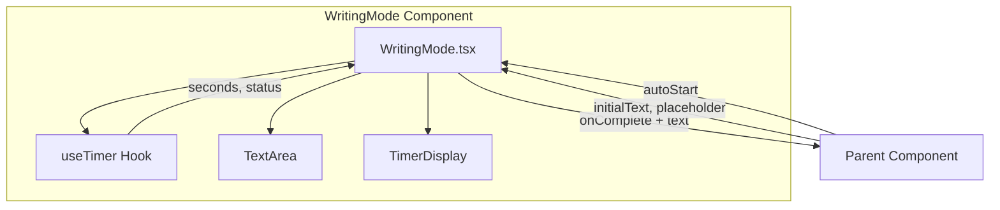
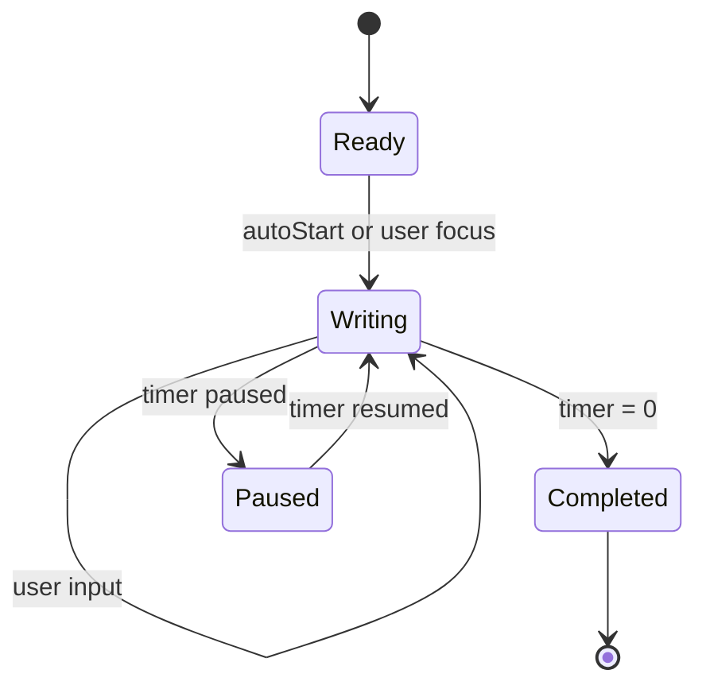
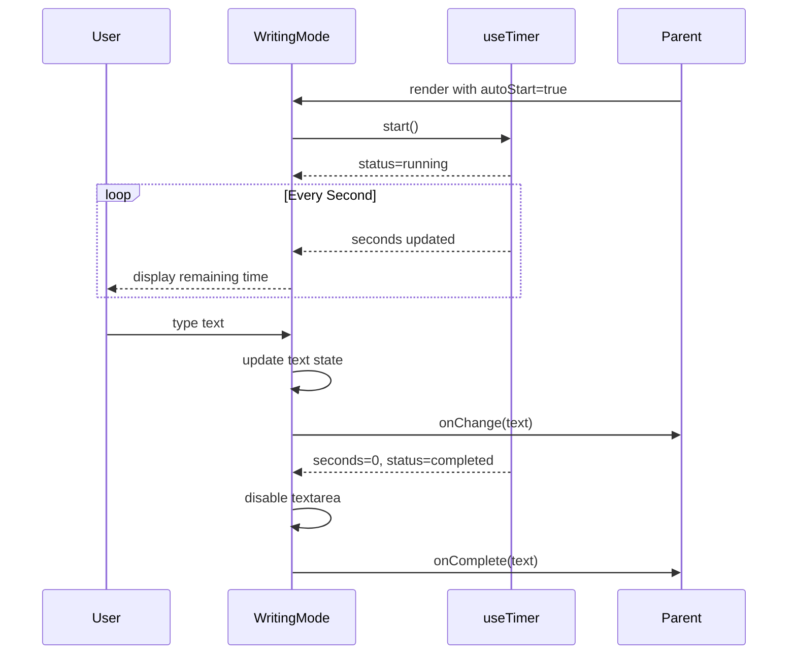

# Technical Design Document: writing-mode (3)

## Overview

**Purpose**: 「瞬発思考」アプリの書き出しモード機能として、ユーザーが20秒間のタイマー制限内で思考をテキストとして書き出すための入力インターフェースを提供する。

**Users**: アプリユーザーがテキストを入力し、親コンポーネント（セッション管理）が入力完了イベントと入力テキストを受け取る。

**Impact**: timer-coreで実装されたuseTimerフックと連携し、時間制限付きの書き出し体験を実現する新規コンポーネント。

### Goals

- 広く視認性の高いテキスト入力エリアの提供
- スマートフォンでの快適な入力体験（レスポンシブデザイン）
- タイマーとの連携による没入感のある書き出し体験
- プレースホルダーによる入力促進
- アクセシビリティ対応

### Non-Goals

- テキストの永続化（後続local-storage specで対応）
- リッチテキスト編集機能
- テキストのバリデーション・文字数制限
- 入力内容のサジェスト・補完機能

## Architecture

### Existing Architecture Analysis

timer-coreで以下の基盤が実装済み：
- `useTimer` フック: タイマーロジック（start, pause, resume, reset, onComplete）
- `TimerStatus` 型: 'idle' | 'running' | 'paused' | 'completed'
- hooks/components/types のディレクトリ構造

書き出しモードは既存のuseTimerフックを活用し、新規コンポーネントとして構築する。

### High-Level Architecture



### Technology Alignment

| 項目 | 技術 | 既存基盤との整合性 |
|------|------|-------------------|
| UIコンポーネント | React 18.x | project-setupで構築済み |
| タイマー連携 | useTimer Hook | timer-coreで実装済み |
| 状態管理 | useState | Reactビルトイン |
| スタイリング | CSS Modules | global.cssと同じアプローチ |
| レスポンシブ | CSS Media Queries | 標準CSS |

### Key Design Decisions

#### Decision 1: useTimerフックを内部で利用

- **Context**: 書き出しモードはタイマーと連携して動作する必要がある
- **Alternatives**:
  - 親コンポーネントからタイマー状態をpropsで渡す
  - 書き出しモード専用のタイマーロジックを実装
- **Selected Approach**: WritingModeコンポーネント内部でuseTimerを直接使用
- **Rationale**:
  - コンポーネントの自己完結性が高まる
  - タイマーと入力の状態を一元管理できる
  - 親コンポーネントはonCompleteコールバックのみを提供すればよい
- **Trade-offs**: タイマー表示の柔軟性は若干低下するが、実装がシンプルになる

#### Decision 2: autoStartプロパティによる自動開始

- **Context**: 書き出しモードが表示されたらすぐにタイマーを開始したいケースがある
- **Alternatives**:
  - 常に手動開始
  - 常に自動開始
- **Selected Approach**: `autoStart` プロパティでオプトイン制御
- **Rationale**:
  - 柔軟な利用シナリオに対応
  - セッションフロー側で開始タイミングを制御可能
- **Trade-offs**: プロパティが増えるが、再利用性が向上

#### Decision 3: 制御されたコンポーネントとしてのtextarea

- **Context**: 入力テキストの状態管理方法
- **Alternatives**:
  - 非制御コンポーネント（useRef）
  - 制御されたコンポーネント（useState）
- **Selected Approach**: useStateで入力値を管理する制御されたコンポーネント
- **Rationale**:
  - onChangeコールバックでリアルタイムに親に通知可能
  - タイマー終了時に確実に現在値を取得可能
  - Reactの推奨パターン
- **Trade-offs**: 大量入力時のパフォーマンス懸念はあるが、20秒制限のため実質問題なし

## State Machine



### WritingMode States

| 状態 | 説明 | ユーザー操作 |
|------|------|-------------|
| `ready` | 初期状態、入力待機 | フォーカスで開始 |
| `writing` | タイマー動作中、入力可能 | テキスト入力 |
| `paused` | タイマー一時停止中、入力可能 | テキスト入力 |
| `completed` | タイマー終了、入力不可 | なし |

## System Flows

### 書き出しフロー



## Components and Interfaces

### Components Layer

#### WritingMode

**Responsibility & Boundaries**
- **Primary Responsibility**: 時間制限付きテキスト入力UIの提供
- **Domain Boundary**: プレゼンテーション層 + タイマー連携
- **Data Ownership**: 入力テキスト、表示状態

**Dependencies**
- **Inbound**: 親コンポーネント（セッション管理）
- **Outbound**: useTimer フック
- **External**: なし

**Contract Definition**

```typescript
interface WritingModeProps {
  /** タイマー初期秒数（デフォルト: 20） */
  initialSeconds?: number;
  /** 初期テキスト */
  initialText?: string;
  /** プレースホルダーテキスト */
  placeholder?: string;
  /** 自動開始フラグ */
  autoStart?: boolean;
  /** テキスト変更時コールバック */
  onChange?: (text: string) => void;
  /** 書き出し完了時コールバック（タイマー終了時） */
  onComplete?: (text: string) => void;
  /** カスタムスタイル用クラス名 */
  className?: string;
}

function WritingMode(props: WritingModeProps): JSX.Element;
```

**State Management**
- `text`: useState<string> - 現在の入力テキスト
- useTimerからの状態: seconds, status, isWarning, start, reset

**Integration Strategy**
- useTimerフックを内部で使用
- タイマー終了時にonCompleteを呼び出し、入力テキストを渡す
- タイマー終了後はtextareaをdisabled状態に

### Hooks Layer

#### useWritingMode（オプション：将来の拡張用）

現時点ではWritingModeコンポーネント内で直接useTimerを使用する。
ロジックが複雑化した場合、useWritingModeフックへの抽出を検討。

## Data Models

### Type Definitions

```typescript
// src/types/writing.ts

export interface WritingModeProps {
  initialSeconds?: number;
  initialText?: string;
  placeholder?: string;
  autoStart?: boolean;
  onChange?: (text: string) => void;
  onComplete?: (text: string) => void;
  className?: string;
}

export interface WritingModeState {
  text: string;
  isDisabled: boolean;
}
```

### Default Values

```typescript
const DEFAULT_PLACEHOLDER = '頭に浮かんだことを書いてみましょう...';
const DEFAULT_INITIAL_SECONDS = 20;
```

## Requirements Traceability

| 要件 | 概要 | 実現コンポーネント/機能 |
|------|------|------------------------|
| 1.1-1.5 | テキスト入力エリア | WritingMode.textarea, useState(text) |
| 2.1-2.5 | レスポンシブデザイン | WritingMode.css (Media Queries) |
| 3.1-3.5 | タイマー連携 | useTimer統合, autoStart, onComplete |
| 4.1-4.5 | プレースホルダー | placeholder prop, CSS styling |
| 5.1-5.5 | 状態管理 | useState, initialText, reset |
| 6.1-6.4 | アクセシビリティ | aria-label, aria-live, focus管理 |

## Error Handling

### Error Categories

| エラー種別 | 原因 | 対処 |
|-----------|------|------|
| 不正な初期値 | initialSeconds <= 0 | useTimer内でデフォルト値にフォールバック |
| コールバック未設定 | onComplete/onChangeがundefined | オプショナルチェイニングで安全に呼び出し |
| 空テキスト完了 | タイマー終了時にテキストが空 | 空文字列をそのまま返す（バリデーションは親の責務） |

### Defensive Implementation

```typescript
// コールバックの安全な呼び出し
const handleComplete = useCallback(() => {
  onComplete?.(text);
}, [text, onComplete]);

// タイマー終了時のdisabled制御
const isDisabled = status === 'completed';
```

## Testing Strategy

### Unit Tests（WritingMode Component）

1. 初期状態で空のtextareaが表示される
2. initialTextが設定されている場合、初期値として表示される
3. placeholderが正しく表示される
4. autoStart=trueでマウント時にタイマーが開始される
5. テキスト入力時にonChangeが呼び出される
6. タイマー終了時にonCompleteが入力テキスト付きで呼び出される
7. タイマー終了後にtextareaがdisabledになる

### Integration Tests

1. useTimerとの連携が正しく動作する
2. タイマー表示が残り秒数を反映する
3. 警告状態（5秒以下）が視覚的に反映される
4. 親コンポーネントへのコールバックが正しいタイミングで発火する

### Visual/Responsive Tests

1. モバイル幅（< 768px）で全幅表示
2. デスクトップ幅（>= 768px）で最大幅・中央揃え
3. ソフトキーボード表示時のレイアウト維持
4. プレースホルダーの色が本文より薄い
5. タップ可能領域が最小44px

### Accessibility Tests

1. aria-labelが設定されている
2. 残り5秒以下でaria-live通知
3. キーボードナビゲーションが動作する
4. フォーカス時のアウトラインが表示される

## File Structure

```
src/
├── components/
│   └── WritingMode/
│       ├── WritingMode.tsx      # メインコンポーネント
│       ├── WritingMode.css      # スタイル
│       ├── WritingMode.test.tsx # テスト
│       └── index.ts             # エクスポート
├── hooks/
│   └── useTimer.ts              # 既存（timer-core）
└── types/
    ├── timer.ts                 # 既存（timer-core）
    └── writing.ts               # 新規
```

## CSS Design

### Responsive Breakpoints

```css
/* モバイル（デフォルト） */
.writing-mode {
  width: 100%;
  padding: 1rem;
}

.writing-mode__textarea {
  width: 100%;
  min-height: 200px;
  font-size: 16px; /* iOS zoom防止 */
  padding: 1rem;
  resize: none;
}

/* デスクトップ */
@media (min-width: 768px) {
  .writing-mode {
    max-width: 640px;
    margin: 0 auto;
  }

  .writing-mode__textarea {
    min-height: 300px;
  }
}
```

### Accessibility Styles

```css
.writing-mode__textarea:focus {
  outline: 2px solid #4a90d9;
  outline-offset: 2px;
}

.writing-mode__textarea::placeholder {
  color: rgba(255, 255, 255, 0.5);
}

.writing-mode__textarea:disabled {
  opacity: 0.7;
  cursor: not-allowed;
}
```
