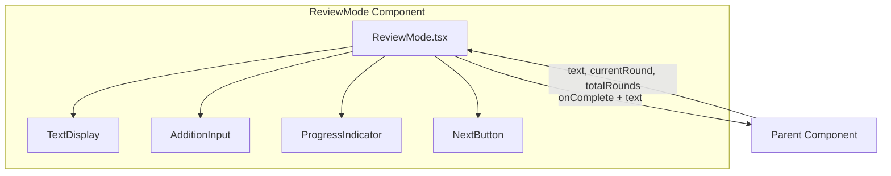
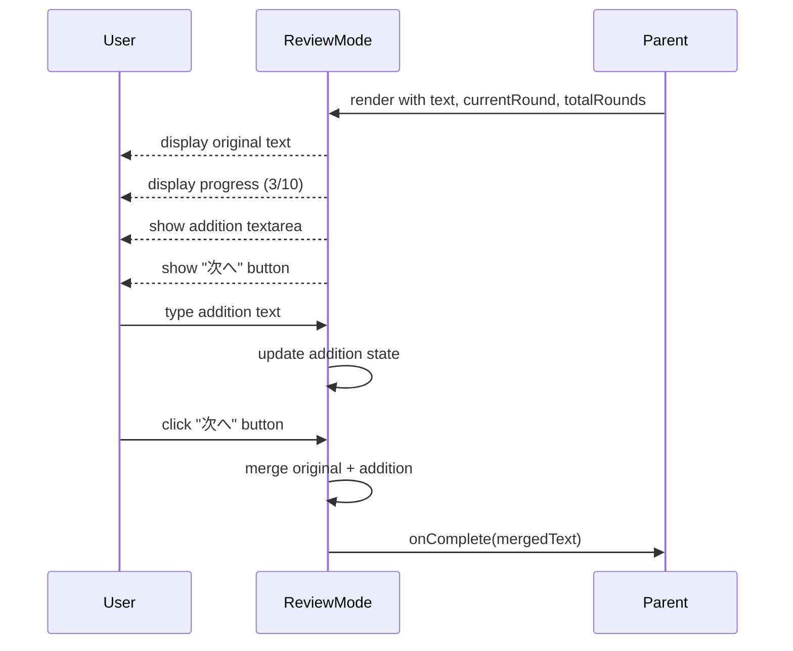
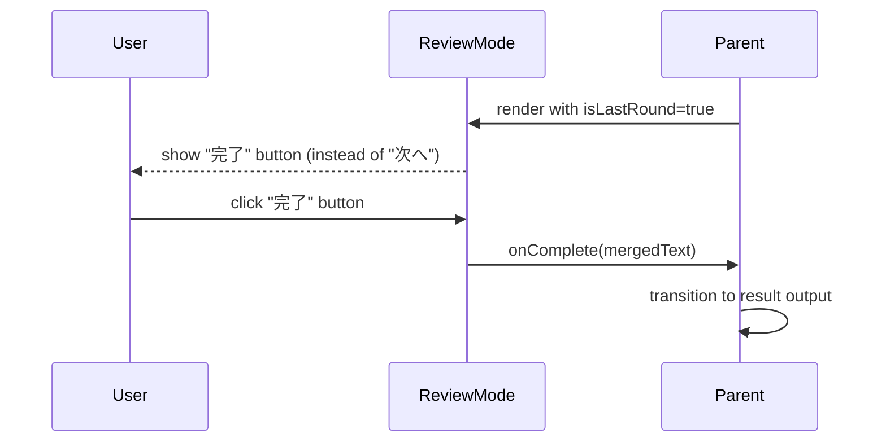

# Technical Design Document: review-mode (4)

## Overview

**Purpose**: 「瞬発思考」アプリの読み返しモード機能として、書き出しモード終了後にユーザーが入力した内容を振り返り、追記を行い、次のラウンドへ進むためのUIを提供する。

**Users**: アプリユーザーが書いた内容を確認・追記し、親コンポーネント（セッション管理）が完了イベントと統合されたメモデータを受け取る。

**Impact**: writing-mode（spec 3）の後続フェーズとして、セッションフロー内でモード切替により表示される新規コンポーネント。

### Goals

- 書き出しモードで入力したテキストの読みやすい表示
- 時間制限なしでの追記機能
- セッション進行状況（現在ラウンド/総ラウンド）の可視化
- 「次へ」ボタンによるスムーズなラウンド遷移
- スマートフォン対応のレスポンシブデザイン
- アクセシビリティ対応

### Non-Goals

- テキストの永続化（後続local-storage specで対応）
- リッチテキスト編集機能
- 追記の時間制限
- 書き出しモードへの戻り機能

## Architecture

### Existing Architecture Analysis

timer-core、writing-mode（spec 3）で以下の基盤が確立済み：
- `useTimer` フック: タイマーロジック
- コンポーネント構造: `src/components/{ComponentName}/` パターン
- 型定義: `src/types/` ディレクトリ、デフォルト値は `export const` でエクスポート
- CSSパターン: CSS Modules風のクラス命名、ダークテーマ
- コールバックパターン: `onComplete` による完了通知
- テストパターン: `data-testid` 属性によるテスト対象指定
- アクセシビリティ: `__sr-only` クラスによるスクリーンリーダー対応

読み返しモードはタイマーを使用せず、シンプルな表示・入力・遷移を担当する。

### High-Level Architecture



### Technology Alignment

| 項目 | 技術 | 既存基盤との整合性 |
|------|------|-------------------|
| UIコンポーネント | React 18.x | project-setupで構築済み |
| 状態管理 | useState | Reactビルトイン（writing-modeと同様） |
| スタイリング | CSS | Timer, WritingModeと同じダークテーマ |
| レスポンシブ | CSS Media Queries | writing-modeと同じブレークポイント |
| コールバック | onComplete パターン | writing-modeと同じ命名規則 |
| テスト | data-testid | writing-modeと同じパターン |

### Key Design Decisions

#### Decision 1: 単一コンポーネントで完結する設計

- **Context**: 読み返しモードの機能範囲と責務分離の度合い
- **Alternatives**:
  - 複数の子コンポーネントに分割（TextDisplay, AdditionInput, ProgressIndicator）
  - 単一コンポーネントで全てを管理
- **Selected Approach**: 単一の`ReviewMode`コンポーネントで全機能を内包
- **Rationale**:
  - 機能が比較的シンプル（表示、入力、ボタン）
  - 状態の共有が容易（追記テキスト）
  - writing-modeと同様のシンプルな構造
- **Trade-offs**: 将来的に機能が増えた場合は分割を検討

#### Decision 2: onCompleteコールバックでシンプルなテキストを返す（spec 3と統一）

- **Context**: 親コンポーネントへのデータ受け渡し方法
- **Alternatives**:
  - 構造化オブジェクト `{ originalText, addition, mergedText }` を返す
  - 統合済みテキスト（string）のみを返す
- **Selected Approach**: writing-modeと同様に `onComplete(text: string)` で統合済みテキストを返す
- **Rationale**:
  - writing-modeとのインターフェース統一
  - セッションフローでの扱いがシンプル
  - 親コンポーネントは統合結果のみを必要とする
- **Trade-offs**: 元テキストと追記を別々に取得したい場合は追加プロパティが必要

#### Decision 3: isLastRoundによる最終ラウンド判定

- **Context**: 最終ラウンドでのボタンラベル変更の制御方法
- **Alternatives**:
  - currentRound === totalRounds で内部判定
  - isLastRound プロパティで外部から明示的に指定
- **Selected Approach**: `isLastRound` プロパティを受け取る
- **Rationale**:
  - セッション管理側で柔軟に最終判定をカスタマイズ可能
  - コンポーネントの責務を表示に集中
  - currentRoundとtotalRoundsの整合性を親が保証
- **Trade-offs**: プロパティが増えるが、柔軟性が向上

## System Flows

### 読み返しフロー



### 最終ラウンドフロー



## Components and Interfaces

### Components Layer

#### ReviewMode

**Responsibility & Boundaries**
- **Primary Responsibility**: 書き出し内容の表示、追記入力、次ラウンド遷移のUI提供
- **Domain Boundary**: プレゼンテーション層
- **Data Ownership**: 追記テキスト状態

**Dependencies**
- **Inbound**: 親コンポーネント（セッション管理）
- **Outbound**: なし（外部フック不要）
- **External**: なし

**Contract Definition**

```typescript
interface ReviewModeProps {
  /** 書き出しモードで入力されたテキスト */
  text: string;
  /** 現在のラウンド番号（1始まり） */
  currentRound: number;
  /** 総ラウンド数 */
  totalRounds: number;
  /** 最終ラウンドかどうか */
  isLastRound?: boolean;
  /** 追記エリアのプレースホルダー */
  additionPlaceholder?: string;
  /** 空テキスト時のプレースホルダー */
  emptyTextPlaceholder?: string;
  /** 読み返し完了時コールバック（統合テキストを返す） */
  onComplete?: (text: string) => void;
  /** カスタムスタイル用クラス名 */
  className?: string;
}

function ReviewMode(props: ReviewModeProps): JSX.Element;
```

**State Management**
- `addition`: useState<string> - 追記テキスト

**Integration Strategy**
- 親コンポーネントから`text`を受け取り表示
- 追記入力をローカル状態で管理
- onComplete呼び出し時に統合済みテキストを返す（writing-modeと同じパターン）

## Data Models

### Type Definitions

```typescript
// src/types/review.ts

/**
 * ReviewMode コンポーネントの Props
 */
export interface ReviewModeProps {
  /** 書き出しモードで入力されたテキスト */
  text: string;
  /** 現在のラウンド番号（1始まり） */
  currentRound: number;
  /** 総ラウンド数 */
  totalRounds: number;
  /** 最終ラウンドかどうか */
  isLastRound?: boolean;
  /** 追記エリアのプレースホルダー */
  additionPlaceholder?: string;
  /** 空テキスト時のプレースホルダー */
  emptyTextPlaceholder?: string;
  /** 読み返し完了時コールバック（統合テキストを返す） */
  onComplete?: (text: string) => void;
  /** カスタムスタイル用クラス名 */
  className?: string;
}

/**
 * デフォルト値（writing-modeと同じエクスポートパターン）
 */
export const DEFAULT_ADDITION_PLACEHOLDER = '追記があればここに...';
export const DEFAULT_EMPTY_TEXT_PLACEHOLDER = '入力がありませんでした';
```

### Data Transformation

```typescript
// 統合ロジック
function mergeTexts(original: string, addition: string): string {
  if (!addition.trim()) {
    return original;
  }
  return `${original}\n\n---\n\n${addition}`;
}
```

## Requirements Traceability

| 要件 | 概要 | 実現コンポーネント/機能 |
|------|------|------------------------|
| 1.1-1.5 | 書いた内容の表示 | ReviewMode.TextDisplay領域 |
| 2.1-2.5 | 追記機能 | ReviewMode.textarea, useState(addition) |
| 3.1-3.5 | 「次へ」ボタン | ReviewMode.button, onComplete callback |
| 4.1-4.5 | 現在の回数/総回数表示 | ReviewMode.ProgressIndicator領域 |
| 5.1-5.5 | レスポンシブデザイン | ReviewMode.css (Media Queries) |
| 6.1-6.5 | 状態管理 | Props (text, currentRound, totalRounds), useState(addition) |
| 7.1-7.5 | アクセシビリティ | aria-label, aria-live, キーボード操作 |

## Error Handling

### Error Categories

| エラー種別 | 原因 | 対処 |
|-----------|------|------|
| 空テキスト | 書き出しモードで入力なし | プレースホルダーメッセージを表示 |
| 不正なラウンド値 | currentRound > totalRounds | そのまま表示（親の責務） |
| コールバック未設定 | onCompleteがundefined | オプショナルチェイニングで安全に呼び出し |

### Defensive Implementation

```typescript
// 空テキストの防御的表示
const displayText = text.trim() || emptyTextPlaceholder;

// コールバックの安全な呼び出し（writing-modeと同じパターン）
const handleComplete = useCallback(() => {
  const mergedText = mergeTexts(text, addition);
  onComplete?.(mergedText);
}, [text, addition, onComplete]);
```

## Testing Strategy

### Unit Tests（ReviewMode Component）

1. 渡されたtextが正しく表示される
2. 空のtextの場合、プレースホルダーが表示される
3. 追記テキストが入力可能
4. currentRound/totalRoundsが正しく表示される（例：「3 / 10」）
5. 「次へ」ボタンクリックでonCompleteが呼び出される
6. onCompleteに統合済みテキストが渡される
7. isLastRound=trueで「完了」ボタンが表示される
8. 追記ありの場合、統合テキストに追記が含まれる
9. 追記なしの場合、元のテキストのみが返される

### Integration Tests

1. 親コンポーネントからのprops更新で表示が更新される
2. ラウンド進行時に追記エリアがリセットされる
3. onCompleteコールバック後の親コンポーネント状態遷移

### Visual/Responsive Tests

1. モバイル幅（< 768px）で全幅表示
2. デスクトップ幅（>= 768px）で最大幅・中央揃え
3. 長いテキストのスクロール/折り返し表示
4. 進行状況表示の位置（画面上部）
5. ボタンサイズが最小44px

### Accessibility Tests

1. 各要素にaria-labelが設定されている
2. 進行状況更新時のaria-live通知
3. キーボードナビゲーション（Tab順序）
4. Enterキーでボタン操作可能
5. フォーカス時のアウトライン表示

## File Structure

```
src/
├── components/
│   ├── Timer/                    # 既存（timer-core）
│   ├── WritingMode/              # 既存（spec 3）
│   └── ReviewMode/               # 新規
│       ├── ReviewMode.tsx        # メインコンポーネント
│       ├── ReviewMode.css        # スタイル
│       ├── ReviewMode.test.tsx   # テスト
│       └── index.ts              # エクスポート
├── hooks/
│   └── useTimer.ts               # 既存（timer-core）
└── types/
    ├── timer.ts                  # 既存（timer-core）
    ├── writing.ts                # 既存（spec 3）
    └── review.ts                 # 新規
```

## CSS Design

### ダークテーマカラー（writing-modeと統一）

```css
/* カラーパレット */
--text-primary: rgba(255, 255, 255, 0.87);
--text-secondary: rgba(255, 255, 255, 0.6);
--text-placeholder: rgba(255, 255, 255, 0.5);
--bg-surface: rgba(255, 255, 255, 0.05);
--border-default: rgba(255, 255, 255, 0.2);
--focus-color: #4a90d9;
--button-next: #4a90d9;
--button-complete: #4caf50;
```

### Responsive Breakpoints

```css
/* モバイルファースト（writing-modeと同じパターン） */
.review-mode {
  width: 100%;
  padding: 1rem;
  display: flex;
  flex-direction: column;
  gap: 1rem;
}

.review-mode__progress {
  text-align: center;
  font-size: 1rem;
  color: rgba(255, 255, 255, 0.6);
}

.review-mode__text-display {
  background-color: rgba(255, 255, 255, 0.05);
  border: 1px solid rgba(255, 255, 255, 0.2);
  border-radius: 8px;
  padding: 1rem;
  font-size: 16px;
  line-height: 1.6;
  white-space: pre-wrap;
  word-wrap: break-word;
  min-height: 100px;
  color: rgba(255, 255, 255, 0.87);
}

.review-mode__text-display--empty {
  color: rgba(255, 255, 255, 0.5);
  font-style: italic;
}

.review-mode__addition {
  width: 100%;
  min-height: 80px;
  padding: 1rem;
  font-size: 16px;
  font-family: inherit;
  line-height: 1.6;
  border: 1px solid rgba(255, 255, 255, 0.2);
  border-radius: 8px;
  resize: vertical;
  background-color: rgba(255, 255, 255, 0.05);
  color: rgba(255, 255, 255, 0.87);
}

.review-mode__addition::placeholder {
  color: rgba(255, 255, 255, 0.5);
}

.review-mode__addition:focus {
  outline: 2px solid #4a90d9;
  outline-offset: 2px;
}

.review-mode__button {
  width: 100%;
  min-height: 44px;
  padding: 0.75rem 1.5rem;
  font-size: 1rem;
  font-weight: bold;
  border: none;
  border-radius: 8px;
  cursor: pointer;
  transition: background-color 0.2s, opacity 0.2s;
}

.review-mode__button:focus {
  outline: 2px solid #4a90d9;
  outline-offset: 2px;
}

.review-mode__button:hover {
  opacity: 0.9;
}

.review-mode__button:active {
  transform: scale(0.98);
}

.review-mode__button--next {
  background-color: #4a90d9;
  color: white;
}

.review-mode__button--complete {
  background-color: #4caf50;
  color: white;
}

/* スクリーンリーダー専用（writing-modeと同じパターン） */
.review-mode__sr-only {
  position: absolute;
  width: 1px;
  height: 1px;
  padding: 0;
  margin: -1px;
  overflow: hidden;
  clip: rect(0, 0, 0, 0);
  white-space: nowrap;
  border: 0;
}

/* デスクトップ */
@media (min-width: 768px) {
  .review-mode {
    max-width: 640px;
    margin: 0 auto;
  }

  .review-mode__text-display {
    min-height: 150px;
  }

  .review-mode__addition {
    min-height: 100px;
  }
}

/* ハイコントラストモード対応 */
@media (prefers-contrast: high) {
  .review-mode__text-display {
    border-color: #fff;
  }

  .review-mode__addition {
    border-color: #fff;
  }
}
```

## Component Implementation Outline

```typescript
// ReviewMode.tsx の構造概要（writing-modeと同じパターン）

import { useState, useCallback } from 'react';
import type { ReviewModeProps } from '../../types/review';
import {
  DEFAULT_ADDITION_PLACEHOLDER,
  DEFAULT_EMPTY_TEXT_PLACEHOLDER,
} from '../../types/review';
import './ReviewMode.css';

// 統合ロジック
function mergeTexts(original: string, addition: string): string {
  if (!addition.trim()) {
    return original;
  }
  return `${original}\n\n---\n\n${addition}`;
}

export function ReviewMode({
  text,
  currentRound,
  totalRounds,
  isLastRound = false,
  additionPlaceholder = DEFAULT_ADDITION_PLACEHOLDER,
  emptyTextPlaceholder = DEFAULT_EMPTY_TEXT_PLACEHOLDER,
  onComplete,
  className,
}: ReviewModeProps) {
  const [addition, setAddition] = useState('');

  const displayText = text.trim() || emptyTextPlaceholder;
  const isEmpty = !text.trim();
  const buttonLabel = isLastRound ? '完了' : '次へ';

  // writing-modeと同じパターン：コールバックの安全な呼び出し
  const handleComplete = useCallback(() => {
    const mergedText = mergeTexts(text, addition);
    onComplete?.(mergedText);
  }, [text, addition, onComplete]);

  return (
    <div
      className={`review-mode ${className ?? ''}`}
      data-testid="review-mode-container"
    >
      {/* 進行状況 */}
      <div
        className="review-mode__progress"
        aria-live="polite"
        data-testid="progress-display"
      >
        {currentRound} / {totalRounds}
      </div>

      {/* テキスト表示 */}
      <div
        className={`review-mode__text-display ${isEmpty ? 'review-mode__text-display--empty' : ''}`}
        aria-label="書き出した内容"
        data-testid="text-display"
      >
        {displayText}
      </div>

      {/* 追記入力 */}
      <textarea
        className="review-mode__addition"
        value={addition}
        onChange={(e) => setAddition(e.target.value)}
        placeholder={additionPlaceholder}
        aria-label="追記入力"
        data-testid="addition-textarea"
      />

      {/* 次へ/完了ボタン */}
      <button
        type="button"
        className={`review-mode__button ${isLastRound ? 'review-mode__button--complete' : 'review-mode__button--next'}`}
        onClick={handleComplete}
        data-testid="next-button"
      >
        {buttonLabel}
      </button>
    </div>
  );
}
```
