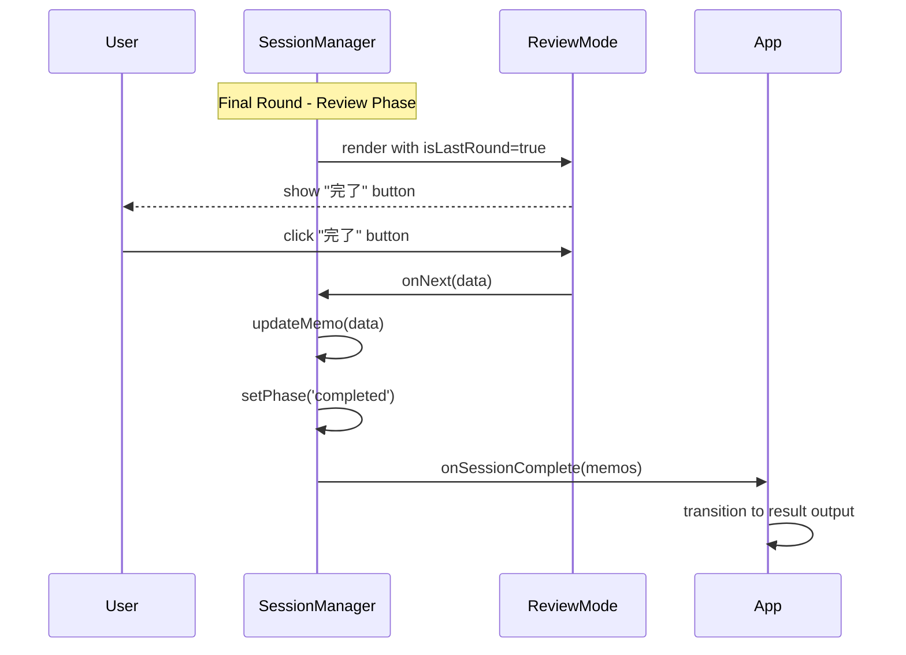

# Technical Design Document: session-flow (5)

## Overview

**Purpose**: 「瞬発思考」アプリのセッション管理機能として、書き出しモードと読み返しモードを統合し、繰り返し回数に基づいたセッションフローを制御する。ユーザーが設定した回数だけ「書き出し→読み返し」のサイクルを繰り返し、セッション完了時に結果出力画面へ遷移するトリガーを提供する。

**Users**: アプリユーザーがセッションを開始・進行・完了し、親コンポーネント（App）がセッション完了イベントと全メモデータを受け取る。

**Impact**: WritingMode（spec 3）とReviewMode（spec 4）を統合する中核コンポーネントとして、アプリ全体のフロー制御を担当する。

### Goals

- 繰り返し回数の設定（デフォルト10回、1-99回対応）
- 書き出し→読み返しのシームレスなモード切替
- セッション進行状態（ラウンド番号、メモ配列）の一元管理
- セッション完了判定と結果出力画面への遷移トリガー
- セッション中断・再開機能（localStorage連携）
- アクセシビリティ対応

### Non-Goals

- 全メモの永続保存（後続local-storage specで対応）
- 結果出力画面のUI（後続output-result specで対応）
- 繰り返し回数のプリセット選択UI
- セッション履歴の一覧表示

## Architecture

### Existing Architecture Analysis

timer-core、writing-mode（spec 3）、review-mode（spec 4）で以下の基盤が確立済み：

- `useTimer` フック: タイマーロジック
- `WritingMode` コンポーネント: 書き出しUI、`onComplete(text)` コールバック
- `ReviewMode` コンポーネント: 読み返しUI、`onNext(data)` コールバック
- コンポーネント構造: `src/components/{ComponentName}/` パターン
- 型定義: `src/types/` ディレクトリ

session-flowはこれらを統合し、モード切替とセッション状態管理を担当する。

### High-Level Architecture


### Technology Alignment

| 項目 | 技術 | 既存基盤との整合性 |
|------|------|-------------------|
| UIコンポーネント | React 18.x | project-setupで構築済み |
| 状態管理 | useReducer + Context | 複雑な状態遷移に対応 |
| セッション永続化 | localStorage | フロントエンド完結型アーキテクチャ |
| スタイリング | CSS Modules | 既存コンポーネントと同じアプローチ |

### Key Design Decisions

#### Decision 1: useReducerによる状態管理

- **Context**: セッションには複数の状態（フェーズ、ラウンド、メモ配列、設定）があり、状態遷移が複雑
- **Alternatives**:
  - 複数のuseStateで個別管理
  - 外部状態管理ライブラリ（Zustand, Jotai）
  - useReducerで一元管理
- **Selected Approach**: useReducerによる状態管理をカスタムフック（useSession）でラップ
- **Rationale**:
  - 状態遷移ロジックが明確に分離される
  - アクションベースで予測可能な状態更新
  - 外部ライブラリ不要でバンドルサイズ抑制
  - テスト容易性が高い
- **Trade-offs**: 初期学習コストはあるが、保守性が向上

#### Decision 2: セッションフェーズのステートマシン設計

- **Context**: セッションには明確なフェーズ遷移がある（設定→書き出し→読み返し→完了）
- **Alternatives**:
  - 複数のbooleanフラグで状態管理
  - 文字列リテラル型で単純管理
  - 明示的なステートマシン設計
- **Selected Approach**: SessionPhase型による明示的なステートマシン
- **Rationale**:
  - 無効な状態遷移を型レベルで防止
  - 各フェーズでの表示コンポーネントが明確
  - デバッグと状態追跡が容易
- **Trade-offs**: 型定義が増えるが、バグ防止に効果的

#### Decision 3: メモデータ構造の統一

- **Context**: spec 4で`ReviewModeResult`として`{ originalText, addition, mergedText }`が定義済み
- **Alternatives**:
  - 統合済みテキスト（string）のみ保存
  - 元テキストと追記を分離して保存
  - ReviewModeResultをそのまま使用
- **Selected Approach**: セッション管理では`Memo`型として統合、内部的に元テキストと追記を保持
- **Rationale**:
  - spec 4との整合性を維持
  - 将来的な分析機能（追記率など）に対応可能
  - 出力時は統合テキストを使用
- **Trade-offs**: データ構造がやや複雑になるが、柔軟性が向上

#### Decision 4: セッション中断・再開のlocalStorage連携

- **Context**: ユーザーがセッション中に離脱した場合の対応
- **Alternatives**:
  - セッション状態を破棄
  - sessionStorageで一時保存（タブ閉じで消失）
  - localStorageで永続保存
- **Selected Approach**: localStorageに進行状態を保存し、再開を促す
- **Rationale**:
  - ブラウザ再起動後も再開可能
  - ユーザー体験の向上
  - 後続local-storage specとの連携準備
- **Trade-offs**: ストレージ容量を消費するが、UX向上に寄与

## State Machine


### Session Phases

| フェーズ | 説明 | 表示コンポーネント |
|---------|------|------------------|
| `setup` | 繰り返し回数設定 | SetupScreen |
| `writing` | 書き出し中 | WritingMode |
| `review` | 読み返し・追記中 | ReviewMode |
| `completed` | セッション完了 | (親に通知) |
| `resuming` | 中断セッション再開確認 | ResumeDialog |

## System Flows

### セッション開始フロー


### ラウンド進行フロー


### セッション完了フロー



### セッション中断・再開フロー


## Components and Interfaces

### Components Layer

#### SessionManager

**Responsibility & Boundaries**
- **Primary Responsibility**: セッション全体のフロー制御と状態管理
- **Domain Boundary**: アプリケーション層（コーディネーター）
- **Data Ownership**: セッション状態（フェーズ、ラウンド、メモ配列、設定）

**Dependencies**
- **Inbound**: App.tsx
- **Outbound**: WritingMode, ReviewMode, SetupScreen, useSession
- **External**: localStorage（中断・再開用）

**Contract Definition**

```typescript
interface SessionManagerProps {
  /** デフォルトの繰り返し回数 */
  defaultTotalRounds?: number;
  /** タイマー初期秒数 */
  timerSeconds?: number;
  /** セッション完了時コールバック */
  onSessionComplete: (memos: Memo[]) => void;
  /** カスタムスタイル用クラス名 */
  className?: string;
}

function SessionManager(props: SessionManagerProps): JSX.Element;
```

**State Management**
- useSession フックで一元管理（後述）

#### SetupScreen

**Responsibility & Boundaries**
- **Primary Responsibility**: 繰り返し回数設定UIの提供
- **Domain Boundary**: プレゼンテーション層
- **Data Ownership**: なし（親から受け取った値を表示・変更）

**Contract Definition**

```typescript
interface SetupScreenProps {
  /** 現在の繰り返し回数 */
  totalRounds: number;
  /** 回数変更時コールバック */
  onTotalRoundsChange: (count: number) => void;
  /** 開始ボタンクリック時コールバック */
  onStart: () => void;
  /** カスタムスタイル用クラス名 */
  className?: string;
}

function SetupScreen(props: SetupScreenProps): JSX.Element;
```

#### ResumeDialog

**Responsibility & Boundaries**
- **Primary Responsibility**: 中断セッション再開確認ダイアログの提供
- **Domain Boundary**: プレゼンテーション層
- **Data Ownership**: なし

**Contract Definition**

```typescript
interface ResumeDialogProps {
  /** 中断時のラウンド番号 */
  interruptedRound: number;
  /** 中断時の総ラウンド数 */
  totalRounds: number;
  /** 再開選択時コールバック */
  onResume: () => void;
  /** 新規開始選択時コールバック */
  onNewSession: () => void;
}

function ResumeDialog(props: ResumeDialogProps): JSX.Element;
```

### Hooks Layer

#### useSession

**Responsibility & Boundaries**
- **Primary Responsibility**: セッション状態のロジック管理
- **Domain Boundary**: アプリケーションロジック層
- **Data Ownership**: セッション状態の管理と永続化

**Contract Definition**

```typescript
interface UseSessionOptions {
  /** デフォルトの繰り返し回数 */
  defaultTotalRounds?: number;
  /** 自動保存を有効にするか */
  enableAutoSave?: boolean;
}

interface UseSessionReturn {
  /** 現在のセッション状態 */
  state: SessionState;
  /** セッション開始 */
  startSession: () => void;
  /** 繰り返し回数を更新 */
  setTotalRounds: (count: number) => void;
  /** 書き出し完了（メモ保存） */
  completeWriting: (text: string) => void;
  /** 読み返し完了（次のラウンドへ） */
  completeReview: (data: ReviewModeResult) => void;
  /** セッションをリセット */
  resetSession: () => void;
  /** 中断セッションを再開 */
  resumeSession: () => void;
  /** 中断セッションを破棄 */
  discardInterruptedSession: () => void;
  /** 最終ラウンドかどうか */
  isLastRound: boolean;
  /** 中断セッションがあるかどうか */
  hasInterruptedSession: boolean;
}

function useSession(options?: UseSessionOptions): UseSessionReturn;
```

## Data Models

### Type Definitions

```typescript
// src/types/session.ts

/**
 * セッションのフェーズ
 */
export type SessionPhase =
  | 'setup'      // 繰り返し回数設定
  | 'writing'    // 書き出し中
  | 'review'     // 読み返し中
  | 'completed'  // セッション完了
  | 'resuming';  // 中断セッション再開確認

/**
 * 1ラウンドのメモデータ
 */
export interface Memo {
  /** ラウンド番号（1始まり） */
  round: number;
  /** 書き出しモードで入力されたテキスト */
  originalText: string;
  /** 読み返しモードで追記されたテキスト */
  addition: string;
  /** 統合されたテキスト */
  mergedText: string;
  /** 作成日時 */
  createdAt: string;
}

/**
 * セッション状態
 */
export interface SessionState {
  /** 現在のフェーズ */
  phase: SessionPhase;
  /** 現在のラウンド番号（1始まり） */
  currentRound: number;
  /** 総ラウンド数 */
  totalRounds: number;
  /** 全ラウンドのメモ */
  memos: Memo[];
  /** 現在のラウンドの一時テキスト（書き出し→読み返し間で保持） */
  currentText: string;
}

/**
 * セッションアクション
 */
export type SessionAction =
  | { type: 'SET_TOTAL_ROUNDS'; payload: number }
  | { type: 'START_SESSION' }
  | { type: 'COMPLETE_WRITING'; payload: string }
  | { type: 'COMPLETE_REVIEW'; payload: ReviewModeResult }
  | { type: 'RESET_SESSION' }
  | { type: 'RESTORE_SESSION'; payload: SessionState }
  | { type: 'SET_PHASE'; payload: SessionPhase };

/**
 * localStorage保存用の中断セッションデータ
 */
export interface InterruptedSession {
  /** セッション状態 */
  state: SessionState;
  /** 保存日時 */
  savedAt: string;
}
```

### Default Values

```typescript
export const DEFAULT_TOTAL_ROUNDS = 10;
export const MIN_ROUNDS = 1;
export const MAX_ROUNDS = 99;
export const STORAGE_KEY = 'memogaki_interrupted_session';
```

### Initial State

```typescript
export const initialSessionState: SessionState = {
  phase: 'setup',
  currentRound: 1,
  totalRounds: DEFAULT_TOTAL_ROUNDS,
  memos: [],
  currentText: '',
};
```

## Requirements Traceability

| 要件 | 概要 | 実現コンポーネント/機能 |
|------|------|------------------------|
| 1.1-1.5 | 繰り返し回数の設定 | SetupScreen, useSession.setTotalRounds |
| 2.1-2.5 | モード切替 | SessionManager条件分岐, useSession.phase |
| 3.1-3.6 | セッション進行状態管理 | useSession.state, Memo配列 |
| 4.1-4.5 | セッション完了判定 | useSession.isLastRound, completeReview |
| 5.1-5.5 | セッション開始・リセット | useSession.startSession/resetSession |
| 6.1-6.5 | セッション状態の提供 | SessionManager→WritingMode/ReviewMode props |
| 7.1-7.5 | セッション中断・再開 | useSession.localStorage連携, ResumeDialog |
| 8.1-8.5 | アクセシビリティ | aria-live, フォーカストラップ |

## Error Handling

### Error Categories

| エラー種別 | 原因 | 対処 |
|-----------|------|------|
| 不正な繰り返し回数 | 範囲外の値入力 | MIN_ROUNDS〜MAX_ROUNDSでクランプ |
| localStorage読み込みエラー | データ破損、パース失敗 | 破損データを削除し新規開始 |
| 状態遷移エラー | 無効なフェーズ遷移 | 現在のフェーズを維持、コンソールに警告 |
| コールバックエラー | onSessionCompleteが例外を投げる | try-catchでラップ、エラーをコンソールに出力 |

### Defensive Implementation

```typescript
// 繰り返し回数のバリデーション
function clampRounds(count: number): number {
  return Math.max(MIN_ROUNDS, Math.min(MAX_ROUNDS, Math.floor(count)));
}

// localStorage読み込みの防御的処理
function loadInterruptedSession(): InterruptedSession | null {
  try {
    const data = localStorage.getItem(STORAGE_KEY);
    if (!data) return null;

    const parsed = JSON.parse(data) as InterruptedSession;
    // 基本的なバリデーション
    if (!parsed.state || typeof parsed.state.currentRound !== 'number') {
      localStorage.removeItem(STORAGE_KEY);
      return null;
    }
    return parsed;
  } catch {
    localStorage.removeItem(STORAGE_KEY);
    return null;
  }
}

// セッション完了通知の安全な呼び出し
function notifyCompletion(
  onSessionComplete: (memos: Memo[]) => void,
  memos: Memo[]
): void {
  try {
    onSessionComplete(memos);
  } catch (error) {
    console.error('Session completion callback failed:', error);
  }
}
```

## Testing Strategy

### Unit Tests（useSession Hook）

1. 初期状態が正しく設定される
2. setTotalRoundsで繰り返し回数が更新される
3. 範囲外の繰り返し回数がクランプされる
4. startSessionでphaseがwritingに遷移する
5. completeWritingでphaseがreviewに遷移しテキストが保存される
6. completeReviewでメモが追加されラウンドがインクリメントされる
7. 最終ラウンドのcompleteReviewでphaseがcompletedになる
8. resetSessionで初期状態に戻る
9. isLastRoundが正しく判定される

### Unit Tests（SessionManager Component）

1. 初期表示でSetupScreenが表示される
2. 開始ボタンでWritingModeに切り替わる
3. WritingMode完了でReviewModeに切り替わる
4. ReviewModeで「次へ」クリックでWritingModeに戻る
5. 最終ラウンドで「完了」クリックでonSessionCompleteが呼ばれる
6. onSessionCompleteに全メモデータが渡される

### Integration Tests

1. WritingModeとのonComplete連携が正しく動作する
2. ReviewModeとのonNext連携が正しく動作する
3. ラウンド進行時にcurrentRound/totalRoundsが正しく更新される
4. localStorage保存・読み込みが正しく動作する
5. 中断セッション再開ダイアログが表示される

### E2E Tests

1. セッション開始から完了までの一連のフロー
2. 10ラウンドのセッションを完走できる
3. ブラウザリロード後に中断セッションを再開できる
4. 中断セッションを破棄して新規開始できる

### Accessibility Tests

1. モード切替時にaria-live通知が発生する
2. 進行状況更新時にスクリーンリーダーに通知される
3. キーボードのみでセッション完走可能
4. ResumeDialogにフォーカストラップが適用される

## File Structure

```
src/
├── components/
│   ├── Timer/                    # 既存（timer-core）
│   ├── WritingMode/              # 既存（spec 3）
│   ├── ReviewMode/               # spec 4で追加
│   └── SessionManager/           # 新規
│       ├── SessionManager.tsx    # メインコンポーネント
│       ├── SessionManager.css    # スタイル
│       ├── SessionManager.test.tsx # テスト
│       ├── SetupScreen.tsx       # 設定画面サブコンポーネント
│       ├── ResumeDialog.tsx      # 再開確認ダイアログ
│       └── index.ts              # エクスポート
├── hooks/
│   ├── useTimer.ts               # 既存（timer-core）
│   ├── useSession.ts             # 新規
│   └── useSession.test.ts        # 新規
└── types/
    ├── timer.ts                  # 既存（timer-core）
    ├── writing.ts                # spec 3
    ├── review.ts                 # spec 4
    └── session.ts                # 新規
```

## CSS Design

### SessionManager Layout

```css
.session-manager {
  width: 100%;
  min-height: 100vh;
  display: flex;
  flex-direction: column;
}

.session-manager__content {
  flex: 1;
  display: flex;
  flex-direction: column;
  justify-content: center;
  padding: 1rem;
}
```

### SetupScreen

```css
.setup-screen {
  display: flex;
  flex-direction: column;
  align-items: center;
  gap: 2rem;
  padding: 2rem;
}

.setup-screen__title {
  font-size: 1.5rem;
  font-weight: bold;
}

.setup-screen__round-input {
  display: flex;
  align-items: center;
  gap: 1rem;
}

.setup-screen__input {
  width: 80px;
  padding: 0.5rem;
  font-size: 1.5rem;
  text-align: center;
  border: 2px solid rgba(0, 0, 0, 0.2);
  border-radius: 8px;
}

.setup-screen__start-button {
  width: 100%;
  max-width: 300px;
  min-height: 56px;
  padding: 1rem 2rem;
  font-size: 1.25rem;
  font-weight: bold;
  border: none;
  border-radius: 12px;
  cursor: pointer;
  background-color: #4a90d9;
  color: white;
  transition: background-color 0.2s;
}

.setup-screen__start-button:hover {
  background-color: #3a7bc8;
}

.setup-screen__start-button:focus {
  outline: 2px solid #4a90d9;
  outline-offset: 2px;
}
```

### ResumeDialog

```css
.resume-dialog {
  position: fixed;
  inset: 0;
  display: flex;
  align-items: center;
  justify-content: center;
  background: rgba(0, 0, 0, 0.5);
  z-index: 100;
}

.resume-dialog__content {
  background: white;
  border-radius: 12px;
  padding: 2rem;
  max-width: 400px;
  width: 90%;
  text-align: center;
}

.resume-dialog__title {
  font-size: 1.25rem;
  font-weight: bold;
  margin-bottom: 1rem;
}

.resume-dialog__info {
  color: rgba(0, 0, 0, 0.6);
  margin-bottom: 1.5rem;
}

.resume-dialog__buttons {
  display: flex;
  flex-direction: column;
  gap: 0.75rem;
}

.resume-dialog__button {
  min-height: 44px;
  padding: 0.75rem 1.5rem;
  font-size: 1rem;
  font-weight: bold;
  border: none;
  border-radius: 8px;
  cursor: pointer;
  transition: background-color 0.2s;
}

.resume-dialog__button--resume {
  background-color: #4a90d9;
  color: white;
}

.resume-dialog__button--new {
  background-color: rgba(0, 0, 0, 0.1);
  color: rgba(0, 0, 0, 0.8);
}
```

### Accessibility

```css
/* スクリーンリーダー専用 */
.sr-only {
  position: absolute;
  width: 1px;
  height: 1px;
  padding: 0;
  margin: -1px;
  overflow: hidden;
  clip: rect(0, 0, 0, 0);
  white-space: nowrap;
  border: 0;
}

/* フォーカストラップ時のbody */
body.dialog-open {
  overflow: hidden;
}
```

### Responsive

```css
@media (min-width: 768px) {
  .setup-screen {
    padding: 3rem;
  }

  .setup-screen__title {
    font-size: 2rem;
  }

  .resume-dialog__buttons {
    flex-direction: row;
    justify-content: center;
  }

  .resume-dialog__button {
    flex: 0 0 auto;
    min-width: 120px;
  }
}
```
