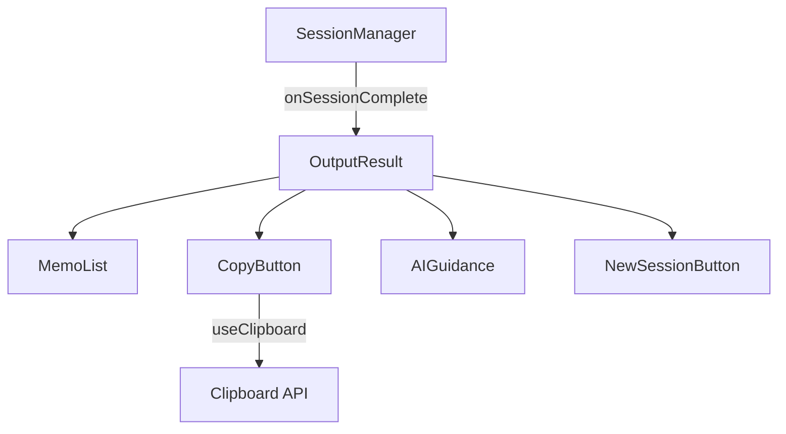
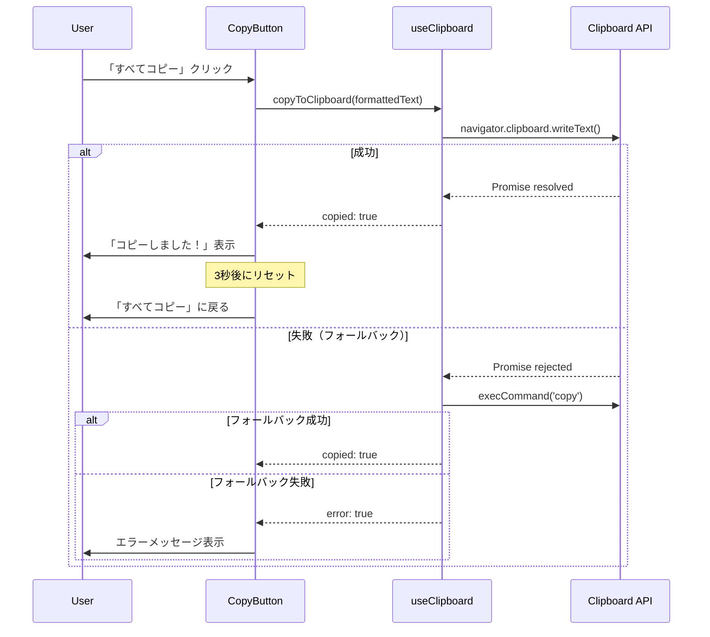

# Technical Design Document

## Overview

**Purpose**: 結果出力機能は、セッション完了後にユーザーが書き出した全メモを一覧表示し、クリップボードコピーとAIエージェントへの活用を促すガイダンスを提供する。

**Users**: 瞬発思考セッションを完了したユーザーが、書き出した内容を振り返り、AIエージェント（Claude、ChatGPTなど）へ貼り付けて深掘りするために利用する。

**Impact**: セッション管理（spec 5）のonSessionCompleteコールバックから呼び出され、アプリの「出口」として機能する。ユーザーの瞬発的なアイデアをAIとの対話に繋げる重要な接続点となる。

### Goals

- セッション中の全メモをラウンド番号付きで一覧表示
- ワンクリックでフォーマット済みテキストをクリップボードにコピー
- AIエージェントへの貼り付けを促す明確なガイダンス提供
- モバイル・デスクトップ両対応のレスポンシブUI

### Non-Goals

- メモの編集機能（読み取り専用表示のみ）
- メモの永続化・保存機能（spec 8: local-storageで対応）
- AIエージェントへの直接連携（コピー＆貼り付けで対応）
- メモの検索・フィルタリング機能

## Architecture

### High-Level Architecture



### Technology Alignment

- **既存パターン準拠**: WritingModeと同様のコンポーネント構造（ディレクトリ、CSS、index.ts）
- **Hooks活用**: クリップボード操作をuseClipboardカスタムフックに分離
- **型安全性**: src/types/output.tsに型定義を集約
- **アクセシビリティ**: aria-live、aria-label、セマンティックHTML使用

### Key Design Decisions

**Decision 1: クリップボード操作のカスタムフック化**

- **Context**: クリップボードコピー、フィードバック表示、エラー処理を一貫して管理する必要がある
- **Alternatives**:
  1. コンポーネント内で直接実装
  2. ユーティリティ関数として切り出し
  3. カスタムフックとして実装
- **Selected Approach**: useClipboardカスタムフックとして実装し、状態管理（copied, error）とコピー関数を提供
- **Rationale**: 既存のuseTimerパターンに準拠し、テスタビリティとリユーザビリティを確保
- **Trade-offs**: フック分離による若干のファイル数増加 vs 責務の明確化とテスト容易性

**Decision 2: Clipboard API with フォールバック**

- **Context**: Clipboard APIは一部ブラウザでサポートされていない
- **Alternatives**:
  1. Clipboard APIのみ使用
  2. execCommand('copy')のみ使用
  3. Clipboard API優先 + execCommandフォールバック
- **Selected Approach**: navigator.clipboard.writeText()を優先し、失敗時はdocument.execCommand('copy')にフォールバック
- **Rationale**: モダンブラウザでは高速・安全なClipboard API、レガシー環境でも動作保証
- **Trade-offs**: フォールバック実装の複雑さ vs 幅広いブラウザサポート

## System Flows

### メモコピーフロー



## Requirements Traceability

| Requirement | Summary | Components | Interfaces |
|-------------|---------|------------|------------|
| 1.1-1.6 | メモ一覧表示 | MemoList | OutputResultProps.memos |
| 2.1-2.6 | クリップボードコピー | CopyButton, useClipboard | useClipboardReturn |
| 3.1-3.5 | コピーフィードバック | CopyButton, useClipboard | copied, error state |
| 4.1-4.5 | AIガイダンス | AIGuidance | hasCopied prop |
| 5.1-5.5 | 新規セッション | NewSessionButton | onStartNewSession |
| 6.1-6.5 | レスポンシブ | OutputResult.css | Media queries |
| 7.1-7.5 | アクセシビリティ | 全コンポーネント | aria-* attributes |

## Components and Interfaces

### UI Layer

#### OutputResult

**Responsibility & Boundaries**
- **Primary Responsibility**: 結果画面全体のレイアウトと状態管理
- **Domain Boundary**: 結果表示ドメイン
- **Data Ownership**: コピー状態（copied）、メモデータ（props経由）

**Dependencies**
- **Inbound**: SessionManager (spec 5)からonSessionComplete経由で呼び出し
- **Outbound**: MemoList, CopyButton, AIGuidance, NewSessionButton

**Contract Definition**

```typescript
interface OutputResultProps {
  /** セッション中に書き出されたメモの配列 */
  memos: Memo[];
  /** 新しいセッション開始時のコールバック */
  onStartNewSession: () => void;
  /** カスタムスタイル用クラス名 */
  className?: string;
}

interface Memo {
  /** ラウンド番号（1から始まる） */
  round: number;
  /** メモの内容（空文字列の場合あり） */
  text: string;
}
```

#### MemoList

**Responsibility & Boundaries**
- **Primary Responsibility**: メモ一覧の表示とフォーマット

**Contract Definition**

```typescript
interface MemoListProps {
  /** 表示するメモの配列 */
  memos: Memo[];
}
```

**Rendering Rules**:
- 各メモをラウンド番号付きで表示
- 空のメモは「（未入力）」と表示
- セマンティックなリスト構造（ol要素）を使用

#### CopyButton

**Responsibility & Boundaries**
- **Primary Responsibility**: コピーボタンの表示とフィードバック管理

**Contract Definition**

```typescript
interface CopyButtonProps {
  /** コピー対象のテキスト */
  textToCopy: string;
  /** コピー完了時のコールバック */
  onCopySuccess?: () => void;
}
```

**State Management**:
- useClipboardフックを使用して状態管理
- copied: true時は「コピーしました！」を表示
- 3秒後に自動リセット

#### AIGuidance

**Responsibility & Boundaries**
- **Primary Responsibility**: AIエージェント活用のガイダンス表示

**Contract Definition**

```typescript
interface AIGuidanceProps {
  /** コピー完了フラグ（強調表示用） */
  hasCopied: boolean;
}
```

**Display Content**:
- AIサービス例示（Claude、ChatGPT）
- 推奨プロンプト例
- コピー後の次ステップ案内

#### NewSessionButton

**Responsibility & Boundaries**
- **Primary Responsibility**: 新規セッション開始ボタンの表示

**Contract Definition**

```typescript
interface NewSessionButtonProps {
  /** クリック時のコールバック */
  onClick: () => void;
}
```

### Hooks Layer

#### useClipboard

**Responsibility & Boundaries**
- **Primary Responsibility**: クリップボード操作の抽象化
- **Data Ownership**: copied状態、error状態

**Contract Definition**

```typescript
interface UseClipboardOptions {
  /** コピー成功表示の持続時間（ms）。デフォルト: 3000 */
  successDuration?: number;
}

interface UseClipboardReturn {
  /** コピー成功フラグ */
  copied: boolean;
  /** エラーフラグ */
  error: boolean;
  /** エラーメッセージ */
  errorMessage: string | null;
  /** クリップボードにコピーする関数 */
  copyToClipboard: (text: string) => Promise<boolean>;
  /** 状態をリセットする関数 */
  reset: () => void;
}
```

**Implementation Strategy**:
1. navigator.clipboard.writeText()を試行
2. 失敗時はexecCommand('copy')フォールバック
3. successDuration後に自動でcopied状態をリセット

## Data Models

### Domain Model

```typescript
/**
 * セッションのメモデータ
 */
interface Memo {
  /** ラウンド番号（1始まり） */
  round: number;
  /** メモ内容 */
  text: string;
}

/**
 * セッション結果データ
 */
interface SessionResult {
  /** 全ラウンドのメモ */
  memos: Memo[];
  /** 総ラウンド数 */
  totalRounds: number;
  /** 入力されたメモ数（空でないもの） */
  filledCount: number;
}
```

### Data Formatting

クリップボードコピー時のフォーマット：

```
1. [メモ1の内容]

2. [メモ2の内容]

3. （未入力）

...
```

## Error Handling

### Error Categories and Responses

**Clipboard Errors**:
- Clipboard API非対応 → execCommandフォールバック
- execCommandも失敗 → ユーザーに手動選択を促すメッセージ表示
- Permission denied → 「クリップボードへのアクセスが許可されていません」表示

**Error Recovery**:
- エラー発生後もUIは操作可能
- 再試行ボタンでリトライ可能

### Accessibility Announcements

```typescript
// コピー成功時
<div role="status" aria-live="polite">コピーしました</div>

// エラー時
<div role="alert" aria-live="assertive">コピーに失敗しました</div>
```

## Testing Strategy

### Unit Tests

1. **useClipboard**: コピー成功/失敗時の状態変化、タイムアウトリセット
2. **formatMemosForClipboard**: メモ配列のフォーマット変換
3. **MemoList**: 空メモの表示、ラウンド番号付与

### Integration Tests

1. **CopyButton + useClipboard**: ボタンクリックからフィードバック表示まで
2. **OutputResult全体**: メモ表示→コピー→ガイダンス強調の流れ

### E2E Tests

1. **完全フロー**: セッション完了→結果表示→コピー→新規セッション開始
2. **モバイル表示**: レスポンシブレイアウトの確認

## File Structure

```
src/
├── components/
│   └── OutputResult/
│       ├── OutputResult.tsx
│       ├── OutputResult.test.tsx
│       ├── OutputResult.css
│       ├── MemoList.tsx
│       ├── CopyButton.tsx
│       ├── AIGuidance.tsx
│       ├── NewSessionButton.tsx
│       └── index.ts
├── hooks/
│   ├── useClipboard.ts
│   └── useClipboard.test.ts
└── types/
    └── output.ts
```
