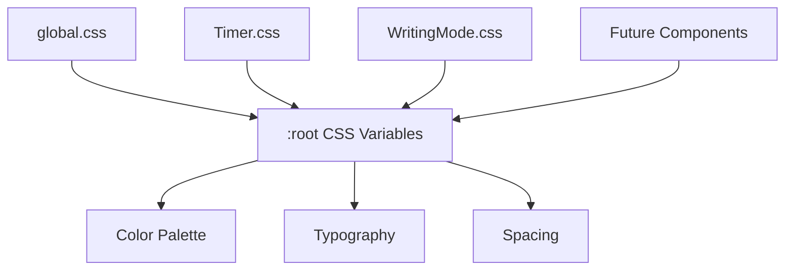

# Technical Design: theme-design

## Overview

**Purpose**: 「瞬発思考」アプリ全体のビジュアルデザインを、現在のダークテーマからノート風の黄色く暖かみのあるライトテーマに変更する。

**Users**: ビジネスパーソン、思考整理をしたい人がターゲット。ノートに手書きする感覚で使えるUIを提供。

**Impact**: 既存の3つのCSSファイル（global.css, Timer.css, WritingMode.css）を更新し、CSS Custom Propertiesによる一元管理を導入する。

### Goals
- アプリ全体を「黄色い優しいノート風」の外観に統一
- CSS Custom Propertiesでカラーパレットを一元管理
- テキストエリアにノート罫線風デザインを適用
- WCAG AA基準のコントラスト比を維持

### Non-Goals
- ダークモード対応（将来検討）
- 複数テーマ切り替え機能
- 外部フォントファイルの導入
- アニメーションの大幅追加

---

## Architecture

### Existing Architecture Analysis

現在のCSS構造:
- `src/styles/global.css`: グローバルスタイル、`:root`変数、レイアウト
- `src/components/Timer/Timer.css`: タイマーコンポーネント固有スタイル
- `src/components/WritingMode/WritingMode.css`: 書き出しモード固有スタイル

現在の課題:
- ハードコードされた色値（#242424, #4a90d9等）
- ダークテーマ前提の配色
- CSS変数の活用が限定的

### High-Level Architecture



**Architecture Integration**:
- 既存パターン維持: コンポーネント単位のCSS分割
- 新規導入: CSS Custom Propertiesによる変数一元管理
- 技術アライメント: Vite CSSバンドリングとの互換性維持

### Technology Alignment

既存の技術スタックを維持:
- Pure CSS（CSS-in-JSは未使用）
- コンポーネント単位のCSSファイル分割
- BEM風の命名規則

新規導入:
- CSS Custom Properties（:root変数）の本格活用
- repeating-linear-gradientによる罫線表現

---

## Key Design Decisions

### Decision 1: CSS Custom Propertiesによるカラー管理

**Decision**: 全ての色値をCSS Custom Propertiesとして`:root`で定義し、コンポーネントから参照する。

**Context**: 現在のCSSはハードコードされた色値が分散しており、テーマ変更時に多数のファイル修正が必要。

**Alternatives**:
1. CSS-in-JS（styled-components等）の導入
2. Sass/SCSS変数の使用
3. CSS Custom Properties（選択）

**Selected Approach**: CSS Custom Propertiesを使用し、`:root`でカラーパレットを定義。

**Rationale**:
- 追加依存関係なし
- ランタイムで変数参照可能
- 既存CSSパターンとの親和性が高い
- 将来のダークモード対応にも対応可能

**Trade-offs**:
- (+) ビルドサイズ増加なし
- (+) 学習コスト最小
- (-) IE11非対応（対象外のため問題なし）

### Decision 2: 罫線表現にrepeating-linear-gradientを使用

**Decision**: テキストエリアの背景に`repeating-linear-gradient`を使用してノートの罫線を表現する。

**Context**: テキストエリアにノート風の横罫線を表示し、手書きノートの雰囲気を出したい。

**Alternatives**:
1. 背景画像（PNG/SVG）の使用
2. repeating-linear-gradient（選択）
3. border-bottomを複数要素で表現

**Selected Approach**: CSSの`repeating-linear-gradient`で罫線パターンを生成。

**Rationale**:
- 画像アセット不要で軽量
- line-heightに合わせた動的調整が容易
- 解像度非依存

**Trade-offs**:
- (+) ファイルサイズ増加なし
- (+) DPI非依存の鮮明な表示
- (-) 古いブラウザでは罫線なしにフォールバック

---

## System Flows

本機能はUIスタイリングのみのため、複雑なフローは存在しない。

CSS適用フロー:
1. `global.css`の`:root`で変数定義
2. 各コンポーネントCSSで`var()`参照
3. ブラウザがカスケードで適用

---

## Requirements Traceability

| Requirement | Summary | Components | CSS Files |
|-------------|---------|------------|-----------|
| FR-1 | カラーパレット | 全体 | global.css (:root) |
| FR-2 | タイポグラフィ | 全体 | global.css |
| FR-3 | ノート風UI | WritingMode | WritingMode.css |
| FR-4 | レイアウト | 全体 | global.css |
| FR-5 | コンポーネントスタイル | Timer, WritingMode | Timer.css, WritingMode.css |
| NFR-2 | アクセシビリティ | 全体 | 全CSS |

---

## Components and Interfaces

### Design System Layer

#### CSS Custom Properties (Design Tokens)

**Responsibility & Boundaries**
- **Primary Responsibility**: アプリ全体で使用する色・フォント・スペーシングの定義
- **Domain Boundary**: `global.css`の`:root`セレクタ内
- **Data Ownership**: カラーパレット、タイポグラフィ設定

**Contract Definition**

```css
:root {
  /* Color Palette - Notebook Theme */
  --color-bg-primary: #FFF9E6;
  --color-bg-secondary: #FFF5D6;
  --color-bg-paper: #FFFBF0;

  --color-text-primary: #3D3D3D;
  --color-text-secondary: #5D4E37;
  --color-text-muted: #8B7355;
  --color-text-placeholder: #B8A88A;

  --color-border: #E0D5C0;
  --color-border-focus: #C4A35A;
  --color-ruled-line: #E8DCC8;

  /* Semantic Colors */
  --color-primary: #C4A35A;
  --color-primary-hover: #B8943D;
  --color-success: #5D8A3E;
  --color-success-hover: #4A7030;
  --color-warning: #D4652E;
  --color-warning-text: #C94A1A;
  --color-muted: #A89880;
  --color-muted-hover: #8B7D68;

  /* Typography */
  --font-family-base: "Hiragino Sans", "Meiryo", system-ui, sans-serif;
  --font-size-timer: 72px;
  --font-size-timer-sm: 48px;
  --font-size-heading: 2rem;
  --font-size-body: 16px;
  --font-size-small: 14px;
  --line-height-body: 1.6;
  --line-height-heading: 1.3;

  /* Spacing */
  --spacing-xs: 0.5rem;
  --spacing-sm: 1rem;
  --spacing-md: 1.5rem;
  --spacing-lg: 2rem;

  /* Layout */
  --max-width-content: 640px;
  --border-radius: 8px;

  /* Shadows */
  --shadow-paper: 0 2px 8px rgba(139, 115, 85, 0.1);
}
```

---

### Component Layer

#### Timer Component Styles

**Responsibility & Boundaries**
- **Primary Responsibility**: タイマー表示とボタンのスタイリング
- **Domain Boundary**: `src/components/Timer/Timer.css`

**Style Updates**

| Element | Current | New |
|---------|---------|-----|
| timer-display color | #f7fafc | var(--color-text-primary) |
| warning color | #e53e3e | var(--color-warning-text) |
| start button | #38a169 | var(--color-success) |
| pause button | #dd6b20 | var(--color-warning) |
| resume button | #3182ce | var(--color-primary) |
| reset button | #718096 | var(--color-muted) |

#### WritingMode Component Styles

**Responsibility & Boundaries**
- **Primary Responsibility**: テキストエリアとノート風罫線の表現
- **Domain Boundary**: `src/components/WritingMode/WritingMode.css`

**Style Updates**

| Element | Current | New |
|---------|---------|-----|
| timer color | rgba(255,255,255,0.87) | var(--color-text-primary) |
| warning color | #ff6b6b | var(--color-warning-text) |
| textarea background | rgba(255,255,255,0.05) | var(--color-bg-paper) |
| textarea border | rgba(255,255,255,0.2) | var(--color-border) |
| focus outline | #4a90d9 | var(--color-border-focus) |
| placeholder | rgba(255,255,255,0.5) | var(--color-text-placeholder) |

**New: Notebook Ruled Lines**

```css
.writing-mode__textarea {
  background-image: repeating-linear-gradient(
    to bottom,
    transparent,
    transparent calc(var(--line-height-body) * 1em - 1px),
    var(--color-ruled-line) calc(var(--line-height-body) * 1em - 1px),
    var(--color-ruled-line) calc(var(--line-height-body) * 1em)
  );
  background-size: 100% calc(var(--line-height-body) * 1em);
  background-position: 0 var(--spacing-sm);
}
```

#### Global Styles

**Responsibility & Boundaries**
- **Primary Responsibility**: 全体レイアウト、リセット、共通スタイル
- **Domain Boundary**: `src/styles/global.css`

**Style Updates**

| Element | Current | New |
|---------|---------|-----|
| body background | #242424 | var(--color-bg-primary) |
| text color | rgba(255,255,255,0.87) | var(--color-text-primary) |
| font-family | Inter, system-ui... | var(--font-family-base) |
| color-scheme | light dark | light |

---

## Data Models

本機能はデータモデルを持たない。CSSのみの変更。

---

## Error Handling

本機能に特有のエラー処理はない。CSSの`var()`にはフォールバック値を設定:

```css
color: var(--color-text-primary, #3D3D3D);
```

---

## Testing Strategy

### Visual Testing
- 各コンポーネントの外観確認（手動）
- モバイル・デスクトップ両方での表示確認
- ブラウザ間の表示確認（Chrome, Safari, Firefox）

### Accessibility Testing
- コントラスト比チェックツール（WebAIM等）で検証
- ハイコントラストモードでの表示確認

### Regression Testing
- 既存の機能テスト（Timer, WritingMode）が引き続きパス
- スナップショットテストは不要（純粋なスタイル変更）

---

## Accessibility Considerations

### Color Contrast Verification

| Element | Foreground | Background | Ratio | WCAG |
|---------|------------|------------|-------|------|
| Body text | #3D3D3D | #FFF9E6 | 10.2:1 | AAA |
| Secondary text | #5D4E37 | #FFF9E6 | 7.1:1 | AAA |
| Placeholder | #B8A88A | #FFFBF0 | 3.2:1 | AA (large) |
| Warning text | #C94A1A | #FFF9E6 | 5.5:1 | AA |
| Button text | #FFFFFF | #C4A35A | 4.8:1 | AA |

### High Contrast Mode Support

```css
@media (prefers-contrast: high) {
  :root {
    --color-border: #3D3D3D;
    --color-ruled-line: #5D4E37;
  }
}
```

---

## Migration Strategy

### Phase 1: CSS Variables導入
1. `global.css`に`:root`変数を追加
2. 既存の色値は維持（並行稼働）

### Phase 2: 段階的置換
1. `global.css`の色値を変数参照に置換
2. `Timer.css`の色値を変数参照に置換
3. `WritingMode.css`の色値を変数参照に置換

### Phase 3: 新テーマ適用
1. `:root`変数をノートテーマの値に更新
2. 罫線スタイルを追加

### Rollback Strategy
- 各フェーズはgitコミットで分離
- 問題発生時は前のコミットに戻すことで即座にロールバック可能
