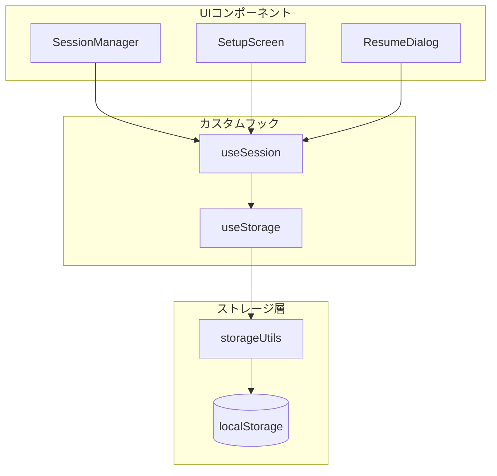
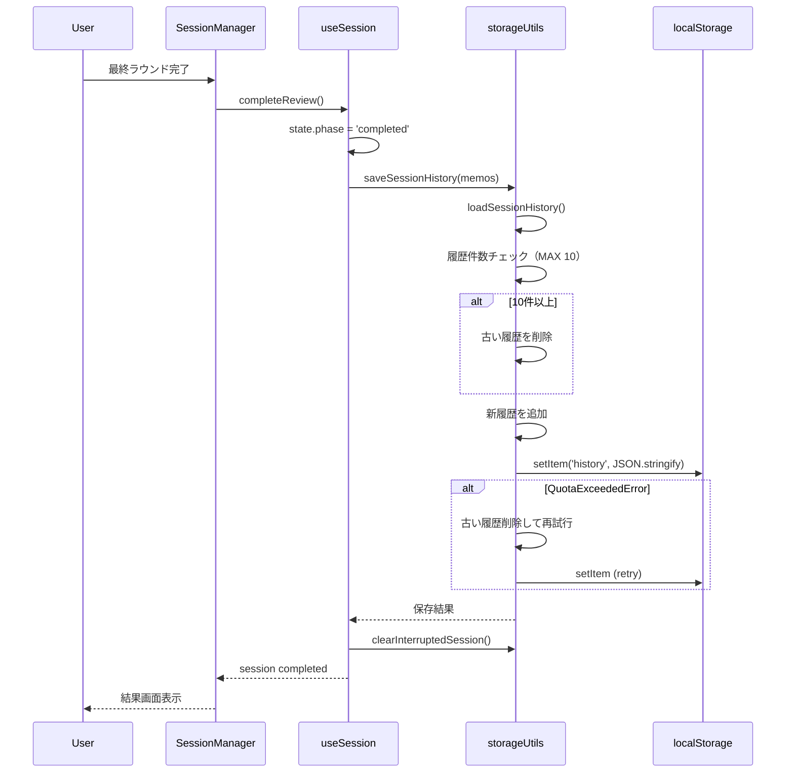
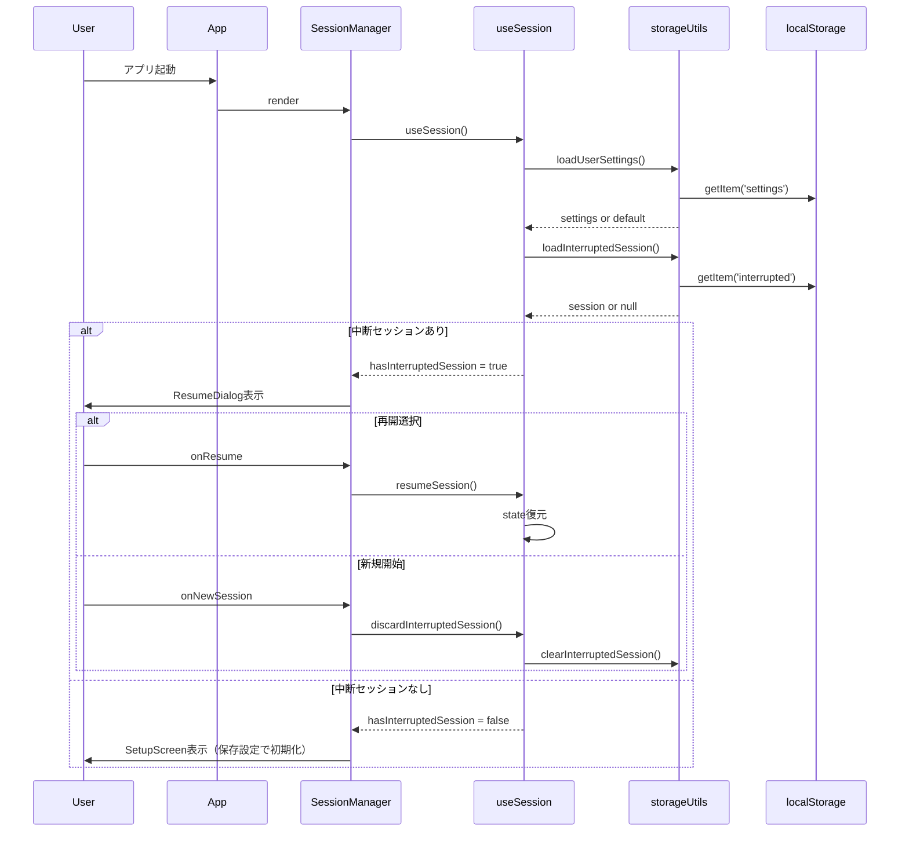
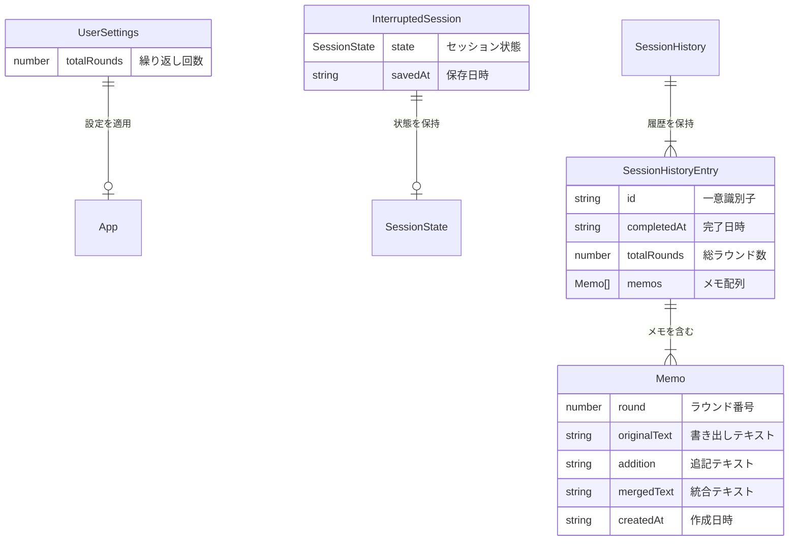

# Technical Design: ローカルストレージ保存

## Overview

**目的**: 本機能は、瞬発思考アプリのユーザーにデータ永続化機能を提供する。セッション履歴の保存、中断セッションの復元、ユーザー設定の永続化を実現し、ブラウザを閉じても継続して利用可能な状態を維持する。

**ユーザー**: 瞬発思考アプリの全ユーザーが、セッション履歴の振り返り、中断セッションの再開、カスタマイズした設定の保持のためにこの機能を利用する。

**影響**: 既存の`useSession`フックに一部実装されている中断セッション保存機能を拡張し、セッション履歴保存・設定永続化・容量管理機能を追加する。

### Goals

- セッション完了時に履歴をlocalStorageに保存し、後から振り返り可能にする
- 中断セッションの自動保存と正確な復元を実現する
- ユーザー設定（繰り返し回数）を永続化し、毎回の設定入力を不要にする
- localStorage操作の統一インターフェースを提供し、コードの保守性を確保する
- ストレージ容量の適切な管理により、安定した動作を保証する

### Non-Goals

- クラウド同期やバックエンド連携は対象外
- セッション履歴の詳細な分析・統計機能は対象外
- 複数デバイス間のデータ共有は対象外
- データのエクスポート/インポート機能は対象外

## Architecture

### 既存実装の分析

現在の`useSession`フックには以下の機能が実装済み:

- **中断セッション保存**: `saveSessionToStorage()` - セッション進行中に自動保存
- **中断セッション読み込み**: `loadInterruptedSession()` - アプリ起動時に読み込み
- **中断セッション削除**: `clearSessionFromStorage()` - 完了/リセット時に削除

不足している機能:

- セッション履歴の保存・読み込み・管理
- ユーザー設定の永続化
- ストレージ容量管理
- 統一されたlocalStorage操作インターフェース

### High-Level Architecture



**アーキテクチャ統合**:

- 既存パターン維持: フック層（`hooks/`）とユーティリティ層の分離を継続
- 新コンポーネント根拠: ストレージ操作の抽象化により、localStorage APIの直接呼び出しを排除
- 技術スタック準拠: React 18のフック、TypeScript strict mode対応
- steering準拠: `structure.md`のコンポーネント設計パターンに従う

### Technology Alignment

本機能は既存の技術スタックを使用し、新規依存関係は追加しない:

- **Web Storage API**: ブラウザ標準のlocalStorage API
- **JSON**: データのシリアライズ/デシリアライズ
- **TypeScript**: 型安全なストレージ操作

**重要な設計決定**:

#### Decision 1: ストレージ層の抽象化

- **決定**: localStorage操作を専用ユーティリティ(`storageUtils.ts`)に集約する
- **コンテキスト**: 現在`useSession`フック内にlocalStorage操作が直接記述されており、テスト困難・再利用性低下の問題がある
- **代替案**:
  1. 現状維持（フック内で直接localStorage操作）
  2. Context Providerパターンでストレージを注入
  3. 専用ユーティリティモジュールに抽象化
- **選択理由**: 専用ユーティリティは最小限の変更で既存コードとの互換性を維持しながら、テスタビリティと再利用性を向上させる
- **トレードオフ**: 新規ファイル追加が必要だが、コードの保守性が大幅に向上する

#### Decision 2: セッション履歴の保存戦略

- **決定**: 最大10件の履歴を保存し、古いものから自動削除する
- **コンテキスト**: localStorageの容量制限（5-10MB）と、実用的な履歴件数のバランス
- **代替案**:
  1. 無制限保存（容量エラー時に削除）
  2. 日数ベースの自動削除
  3. 件数ベースの自動削除
- **選択理由**: 件数ベースは予測可能で実装がシンプル。10件は約1週間分の日常使用に対応
- **トレードオフ**: 大量の履歴保存は不可だが、アプリの用途（日々のトレーニング）には十分

## System Flows

### セッション完了時の履歴保存フロー



### アプリ起動時の復元フロー



## Requirements Traceability

| 要件 | 要件概要 | コンポーネント | インターフェース | フロー |
|------|----------|----------------|------------------|--------|
| 1.1-1.4 | セッション履歴保存 | storageUtils, useSession | saveSessionHistory, loadSessionHistory | 履歴保存フロー |
| 2.1-2.5 | 中断セッション復元 | storageUtils, useSession, ResumeDialog | saveInterruptedSession, loadInterruptedSession | 起動時復元フロー |
| 3.1-3.4 | ユーザー設定永続化 | storageUtils, useSession, SetupScreen | saveUserSettings, loadUserSettings | 設定保存/読み込み |
| 4.1-4.5 | データ読み書き | storageUtils | StorageService全メソッド | 各フロー共通 |
| 5.1-5.3 | 容量管理 | storageUtils | enforceHistoryLimit, handleQuotaError | 履歴保存フロー |

## Components and Interfaces

### ストレージ層

#### storageUtils

**責務と境界**

- **主要責務**: localStorage操作の抽象化と型安全なデータアクセスの提供
- **ドメイン境界**: インフラストラクチャ層（永続化）
- **データ所有**: localStorage内の全アプリデータ（履歴、設定、中断セッション）

**依存関係**

- **インバウンド**: useSession, useStorage
- **アウトバウンド**: Web Storage API (localStorage)
- **外部**: なし

**サービスインターフェース**

```typescript
// src/utils/storageUtils.ts

/**
 * ストレージキー定数
 */
export const STORAGE_KEYS = {
  INTERRUPTED_SESSION: 'memogaki_interrupted_session',
  SESSION_HISTORY: 'memogaki_session_history',
  USER_SETTINGS: 'memogaki_user_settings',
} as const;

/**
 * ストレージ容量定数
 */
export const STORAGE_LIMITS = {
  MAX_HISTORY_COUNT: 10,
} as const;

/**
 * セッション履歴エントリ
 */
export interface SessionHistoryEntry {
  /** 一意識別子 */
  id: string;
  /** 完了日時（ISO8601形式） */
  completedAt: string;
  /** 総ラウンド数 */
  totalRounds: number;
  /** 全メモデータ */
  memos: Memo[];
}

/**
 * ユーザー設定
 */
export interface UserSettings {
  /** 繰り返し回数 */
  totalRounds: number;
}

/**
 * ストレージサービス
 * localStorage操作を抽象化し、型安全なアクセスを提供
 */
export interface StorageService {
  // セッション履歴
  saveSessionHistory(memos: Memo[], totalRounds: number): StorageResult<void>;
  loadSessionHistory(): StorageResult<SessionHistoryEntry[]>;
  clearSessionHistory(): void;

  // 中断セッション
  saveInterruptedSession(state: SessionState): StorageResult<void>;
  loadInterruptedSession(): StorageResult<InterruptedSession | null>;
  clearInterruptedSession(): void;

  // ユーザー設定
  saveUserSettings(settings: UserSettings): StorageResult<void>;
  loadUserSettings(): StorageResult<UserSettings | null>;

  // ユーティリティ
  isStorageAvailable(): boolean;
}

/**
 * ストレージ操作の結果
 */
export type StorageResult<T> =
  | { success: true; data: T }
  | { success: false; error: StorageError };

/**
 * ストレージエラー種別
 */
export type StorageError =
  | { type: 'QUOTA_EXCEEDED'; message: string }
  | { type: 'PARSE_ERROR'; message: string }
  | { type: 'STORAGE_UNAVAILABLE'; message: string };
```

**状態管理**

- **永続化**: localStorageに3種類のキーでデータを保存
- **同時実行**: シングルスレッド（ブラウザ環境）のため考慮不要

#### useStorage (カスタムフック)

**責務と境界**

- **主要責務**: ストレージ状態のReact統合とリアクティブな状態管理
- **ドメイン境界**: プレゼンテーション層（Reactフック）

**サービスインターフェース**

```typescript
// src/hooks/useStorage.ts

export interface UseStorageOptions {
  /** ストレージ利用不可時のフォールバック動作 */
  enableFallback?: boolean;
}

export interface UseStorageReturn {
  /** ストレージが利用可能か */
  isAvailable: boolean;
  /** セッション履歴 */
  history: SessionHistoryEntry[];
  /** ユーザー設定 */
  settings: UserSettings | null;
  /** 中断セッション */
  interruptedSession: InterruptedSession | null;
  /** 履歴を保存 */
  saveHistory: (memos: Memo[], totalRounds: number) => boolean;
  /** 設定を保存 */
  saveSettings: (settings: UserSettings) => boolean;
  /** 中断セッションを保存 */
  saveInterrupted: (state: SessionState) => boolean;
  /** 中断セッションを削除 */
  clearInterrupted: () => void;
  /** 最後のエラー */
  lastError: StorageError | null;
}

export function useStorage(options?: UseStorageOptions): UseStorageReturn;
```

### フック層

#### useSession (拡張)

**統合戦略**

- **変更アプローチ**: 既存のuseSessionフックを拡張し、useStorageフックを内部で使用
- **後方互換性**: 既存のAPIを維持しつつ、内部実装をuseStorageに移行
- **移行パス**: 段階的にlocalStorage直接操作をuseStorage経由に置き換え

**インターフェース変更**

```typescript
// src/hooks/useSession.ts (拡張部分)

export interface UseSessionOptions {
  /** デフォルトの繰り返し回数 */
  defaultTotalRounds?: number;
  /** 自動保存を有効にするか */
  enableAutoSave?: boolean;
  /** 設定の自動読み込みを有効にするか（新規） */
  enableSettingsPersistence?: boolean;
}

export interface UseSessionReturn {
  // 既存のプロパティ...

  /** ユーザー設定が読み込まれたか（新規） */
  settingsLoaded: boolean;
  /** ストレージエラー（新規） */
  storageError: StorageError | null;
}
```

## Data Models

### Logical Data Model



### Physical Data Model (localStorage)

**キー設計**

| キー名 | データ型 | 説明 |
|--------|----------|------|
| `memogaki_interrupted_session` | InterruptedSession | 中断セッションデータ |
| `memogaki_session_history` | SessionHistoryEntry[] | セッション履歴（最大10件） |
| `memogaki_user_settings` | UserSettings | ユーザー設定 |

**容量見積もり**

- 1メモ: 約500bytes（平均的なテキスト量）
- 1セッション履歴: 約5KB（10ラウンド）
- 10セッション履歴: 約50KB
- 中断セッション: 約5KB
- ユーザー設定: 約100bytes
- **合計最大**: 約60KB（localStorageの5MBに対して十分余裕あり）

## Error Handling

### Error Strategy

ストレージ操作は非クリティカルな機能として設計し、エラー発生時もアプリの基本機能は継続動作する。

### Error Categories and Responses

**ユーザーエラー**: なし（ストレージ操作はシステム内部で完結）

**システムエラー**:

| エラー種別 | 原因 | 対応 |
|------------|------|------|
| QUOTA_EXCEEDED | localStorage容量超過 | 古い履歴を削除して再試行、それでも失敗時は通知 |
| PARSE_ERROR | 保存データの破損 | デフォルト値にフォールバック、破損データを削除 |
| STORAGE_UNAVAILABLE | プライベートブラウズ等 | 保存機能を無効化、アプリは通常動作を継続 |

**ビジネスロジックエラー**: なし

### Monitoring

- エラー発生時は`console.warn`でログ出力
- UIへのエラー通知は最小限（保存失敗時のみ簡潔な通知）

## Testing Strategy

### Unit Tests

- `storageUtils.ts`:
  - 各ストレージ操作関数の正常系テスト
  - JSON parse/stringifyエラーのハンドリング
  - 容量制限の適用（履歴10件制限）
  - QuotaExceededErrorの処理
  - localStorage利用不可時のフォールバック

### Integration Tests

- `useStorage.ts`:
  - storageUtilsとの統合動作
  - Reactの状態更新との同期
  - 複数のストレージ操作の連携

- `useSession.ts`:
  - useStorageとの統合動作
  - セッション完了時の履歴保存
  - 設定の読み込みと初期化
  - 中断セッションの保存/復元フロー

### E2E Tests

- セッション完了→履歴保存→ページリロード→履歴確認
- セッション中断→ページリロード→再開ダイアログ→復元
- 設定変更→ページリロード→設定維持の確認
- プライベートブラウズでの正常動作確認

## Security Considerations

### データ保護

- **機密性**: 思考内容がlocalStorageに平文で保存される。ユーザーに対してこの動作を明示することを推奨
- **整合性**: JSONパース時のバリデーションにより、改ざんされたデータからの保護
- **可用性**: localStorage利用不可時のグレースフル・デグラデーション

### 脅威モデル

- **XSS攻撃**: localStorageはXSS攻撃に対して脆弱。CSP設定とReactの自動エスケープで緩和
- **共有PC**: 他ユーザーにデータが見える可能性あり。将来的にデータ削除機能の検討を推奨
