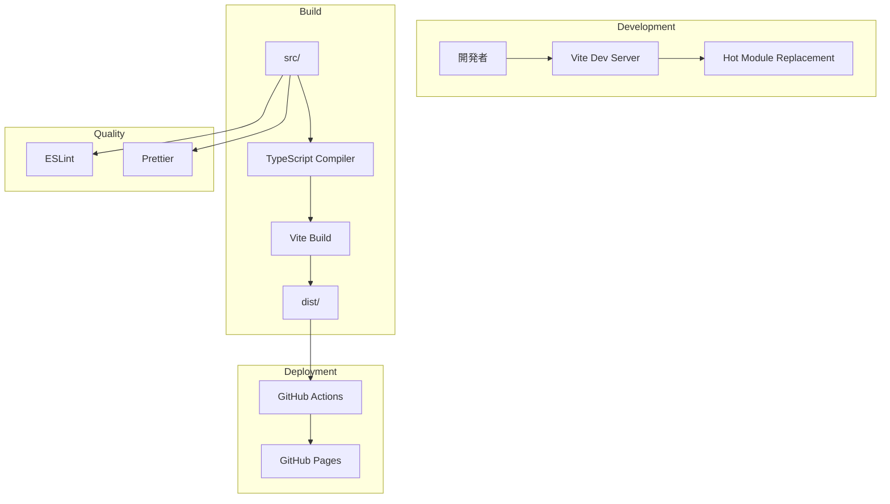

# Technical Design Document: project-setup

## Overview

**Purpose**: 本機能は「瞬発思考」アプリの開発基盤を提供する。開発者が効率的にReact + TypeScriptでフロントエンド開発を行い、GitHub Pagesへ自動デプロイできる環境を整備する。

**Users**: 本プロジェクトの開発者が、ローカル開発、コード品質管理、本番デプロイのワークフローを利用する。

**Impact**: ゼロからの新規プロジェクト構築であり、以降のすべての機能開発の土台となる。

### Goals

- Viteを使用したReact + TypeScript開発環境の構築
- GitHub Pagesへの自動デプロイパイプラインの確立
- ESLint + Prettierによるコード品質の自動管理
- 拡張性を考慮したディレクトリ構成の策定

### Non-Goals

- 実際のアプリケーション機能の実装（タイマー、入力フォーム等）
- テストフレームワークの導入（後続specで対応）
- CI/CDパイプラインの高度な設定（ステージング環境等）
- パフォーマンス最適化設定

## Architecture

### High-Level Architecture



### Technology Stack

| レイヤー | 技術 | バージョン | 選定理由 |
|---------|------|-----------|---------|
| フレームワーク | React | 18.x | コンポーネントベースUI、豊富なエコシステム |
| 言語 | TypeScript | 5.x | 型安全性、開発時エラー検出 |
| ビルドツール | Vite | 5.x | 高速なHMR、最適化されたビルド |
| リンター | ESLint | 9.x | Flat Config対応、TypeScript統合 |
| フォーマッター | Prettier | 3.x | 一貫したコードスタイル |
| ホスティング | GitHub Pages | - | 無料、GitHub統合 |
| CI/CD | GitHub Actions | - | GitHub統合、自動デプロイ |

### Key Design Decisions

#### Decision 1: Viteをビルドツールとして採用

- **Context**: React + TypeScriptプロジェクトのビルドツール選定
- **Alternatives**: Create React App、Next.js、Parcel
- **Selected Approach**: Viteを使用し、開発サーバーとプロダクションビルドを統合管理
- **Rationale**:
  - ESModulesベースの高速な開発サーバー
  - TypeScript/React公式テンプレート提供
  - GitHub Pages向け静的サイト出力に最適
  - CRAより軽量で高速
- **Trade-offs**: Next.jsのようなSSR/ISR機能は利用不可（本プロジェクトでは不要）

#### Decision 2: ESLint Flat Configを採用

- **Context**: ESLint設定形式の選定
- **Alternatives**: 従来の.eslintrc形式
- **Selected Approach**: ESLint 9.x のFlat Config（eslint.config.js）を使用
- **Rationale**:
  - ESLint公式推奨の新形式
  - より明確な設定の優先順位
  - TypeScript ESLintとの良好な統合
- **Trade-offs**: 一部古いプラグインとの互換性に注意が必要

## Project Structure

### Directory Layout

```
memogaki/
├── .github/
│   └── workflows/
│       └── deploy.yml          # GitHub Pages自動デプロイ
├── src/
│   ├── components/             # 再利用可能なUIコンポーネント
│   ├── pages/                  # ページレベルコンポーネント
│   ├── hooks/                  # カスタムReactフック
│   ├── utils/                  # ユーティリティ関数
│   ├── types/                  # 共通型定義
│   ├── styles/                 # グローバルスタイル
│   ├── App.tsx                 # ルートコンポーネント
│   ├── main.tsx                # エントリーポイント
│   └── vite-env.d.ts           # Vite型定義
├── public/                     # 静的アセット
├── dist/                       # ビルド出力（gitignore）
├── index.html                  # HTMLテンプレート
├── package.json                # 依存関係・スクリプト
├── tsconfig.json               # TypeScript設定
├── tsconfig.node.json          # Node用TypeScript設定
├── vite.config.ts              # Vite設定
├── eslint.config.js            # ESLint設定
├── .prettierrc                 # Prettier設定
└── .gitignore                  # Git除外設定
```

### Directory Responsibilities

| ディレクトリ | 責務 | 命名規則 |
|-------------|------|---------|
| `src/components/` | 再利用可能なUIコンポーネント | PascalCase（例: `Timer.tsx`） |
| `src/pages/` | ルーティング対象のページ | PascalCase（例: `WritingPage.tsx`） |
| `src/hooks/` | カスタムReactフック | camelCase、`use`プレフィックス（例: `useTimer.ts`） |
| `src/utils/` | 純粋関数、ヘルパー | camelCase（例: `formatTime.ts`） |
| `src/types/` | 共通型定義 | camelCase（例: `session.ts`） |
| `src/styles/` | グローバルCSS | camelCase（例: `global.css`） |

## Components and Interfaces

### Build Configuration

#### vite.config.ts

**Responsibility & Boundaries**
- **Primary Responsibility**: Viteビルド設定の一元管理
- **Domain Boundary**: ビルドプロセス設定

**Contract Definition**

```typescript
interface ViteConfig {
  base: string;                    // GitHub Pages用ベースパス
  plugins: PluginOption[];         // Reactプラグイン
  build: {
    outDir: string;                // 出力ディレクトリ
    sourcemap: boolean;            // ソースマップ生成
  };
}
```

**設定値**:
- `base`: `/memogaki/`（リポジトリ名）
- `outDir`: `dist`
- `sourcemap`: `false`（本番）

#### tsconfig.json

**Responsibility & Boundaries**
- **Primary Responsibility**: TypeScriptコンパイラ設定
- **Domain Boundary**: 型チェック・コンパイル設定

**Contract Definition**

```typescript
interface TSConfig {
  compilerOptions: {
    target: 'ES2020';
    lib: ['ES2020', 'DOM', 'DOM.Iterable'];
    module: 'ESNext';
    moduleResolution: 'bundler';
    strict: true;
    jsx: 'react-jsx';
    noEmit: true;                  // Viteがビルド担当
    skipLibCheck: true;
    noUnusedLocals: true;
    noUnusedParameters: true;
  };
  include: ['src'];
}
```

### Code Quality Configuration

#### eslint.config.js

**Responsibility & Boundaries**
- **Primary Responsibility**: コード品質ルールの定義・実行
- **Domain Boundary**: 静的解析設定

**Dependencies**
- **Outbound**: `@eslint/js`, `typescript-eslint`, `eslint-plugin-react-hooks`, `eslint-config-prettier`

**Contract Definition**

```typescript
interface ESLintFlatConfig {
  files: string[];                 // 対象ファイルパターン
  languageOptions: {
    parser: typeof tsParser;
    parserOptions: ParserOptions;
  };
  plugins: Record<string, ESLintPlugin>;
  rules: Record<string, RuleConfig>;
}
```

**ルールセット**:
- TypeScript推奨ルール
- React Hooks依存配列チェック
- 未使用変数エラー
- Prettierとの競合回避

#### .prettierrc

**Responsibility & Boundaries**
- **Primary Responsibility**: コードフォーマットルールの定義

**Contract Definition**

```typescript
interface PrettierConfig {
  semi: true;                      // セミコロン使用
  singleQuote: true;               // シングルクォート
  tabWidth: 2;                     // インデント幅
  trailingComma: 'es5';            // 末尾カンマ
  printWidth: 100;                 // 行幅
}
```

### CI/CD Configuration

#### .github/workflows/deploy.yml

**Responsibility & Boundaries**
- **Primary Responsibility**: GitHub Pagesへの自動デプロイ
- **Domain Boundary**: CI/CDパイプライン

**Contract Definition**

```yaml
trigger:
  branches: [main]

jobs:
  deploy:
    steps:
      - checkout
      - setup-node (v20)
      - npm ci
      - npm run build
      - deploy to gh-pages
```

**ワークフロー仕様**:
- トリガー: mainブランチへのpush
- Node.js: v20
- デプロイ先: gh-pagesブランチ
- 権限: `contents: read`, `pages: write`, `id-token: write`

## Requirements Traceability

| 要件 | 概要 | 実現コンポーネント |
|------|------|-------------------|
| 1.1-1.5 | React + TypeScript環境 | `vite.config.ts`, `tsconfig.json`, `package.json` |
| 2.1-2.5 | GitHub Pagesデプロイ | `vite.config.ts`, `.github/workflows/deploy.yml` |
| 3.1-3.7 | ディレクトリ構成 | `src/` 配下のディレクトリ構造 |
| 4.1-4.5 | ESLint設定 | `eslint.config.js`, `package.json` scripts |
| 5.1-5.6 | Prettier設定 | `.prettierrc`, `eslint.config.js`, `package.json` scripts |
| 6.1-6.6 | 開発スクリプト | `package.json` scripts |

## npm Scripts

```json
{
  "scripts": {
    "dev": "vite",
    "build": "tsc -b && vite build",
    "preview": "vite preview",
    "lint": "eslint src/",
    "lint:fix": "eslint src/ --fix",
    "format": "prettier --write src/",
    "format:check": "prettier --check src/",
    "type-check": "tsc --noEmit"
  }
}
```

## Dependencies

### Production Dependencies

| パッケージ | 用途 |
|-----------|------|
| `react` | UIライブラリ |
| `react-dom` | ReactのDOM統合 |

### Development Dependencies

| パッケージ | 用途 |
|-----------|------|
| `typescript` | 型システム |
| `vite` | ビルドツール |
| `@vitejs/plugin-react` | Vite React統合 |
| `@types/react` | React型定義 |
| `@types/react-dom` | ReactDOM型定義 |
| `eslint` | リンター |
| `@eslint/js` | ESLint基本設定 |
| `typescript-eslint` | TypeScript ESLint統合 |
| `eslint-plugin-react-hooks` | React Hooksルール |
| `eslint-config-prettier` | Prettier競合回避 |
| `prettier` | フォーマッター |

## Testing Strategy

### Build Verification Tests

- `npm run build` が正常終了すること
- `dist/` ディレクトリに `index.html` が生成されること
- 生成されたHTMLが正しいベースパスを参照していること

### Lint/Format Tests

- `npm run lint` がエラーなく完了すること
- `npm run format:check` がフォーマット済みを確認すること
- `npm run type-check` が型エラーなく完了すること

### Deployment Tests

- GitHub Actionsワークフローが正常に実行されること
- デプロイ後、GitHub PagesのURLでアプリにアクセスできること

## Error Handling

### Build Errors

| エラー種別 | 原因 | 対処 |
|-----------|------|------|
| TypeScriptコンパイルエラー | 型不整合 | `npm run type-check` で詳細確認 |
| Viteビルドエラー | 設定不備、依存関係問題 | `vite.config.ts` 確認 |
| ESLintエラー | ルール違反 | `npm run lint:fix` で自動修正 |

### Deployment Errors

| エラー種別 | 原因 | 対処 |
|-----------|------|------|
| 404エラー | ベースパス不正 | `vite.config.ts` の `base` 確認 |
| Actionsエラー | 権限不足 | リポジトリ Settings > Pages 確認 |
