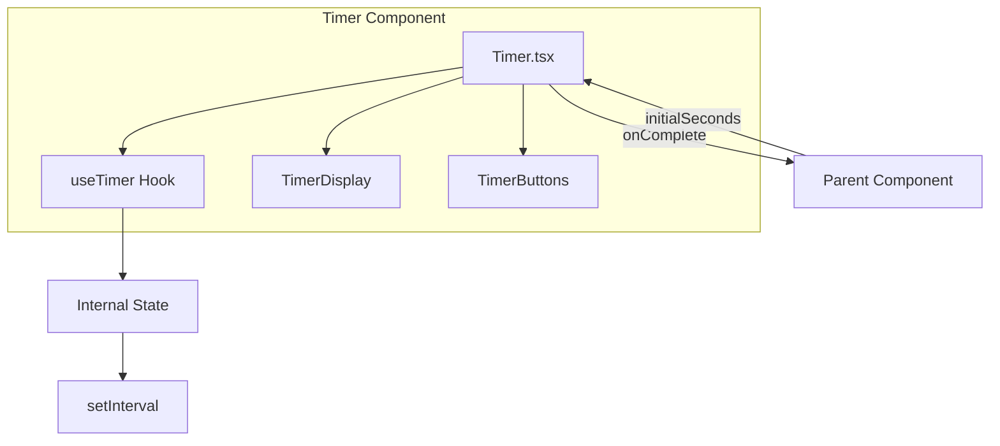
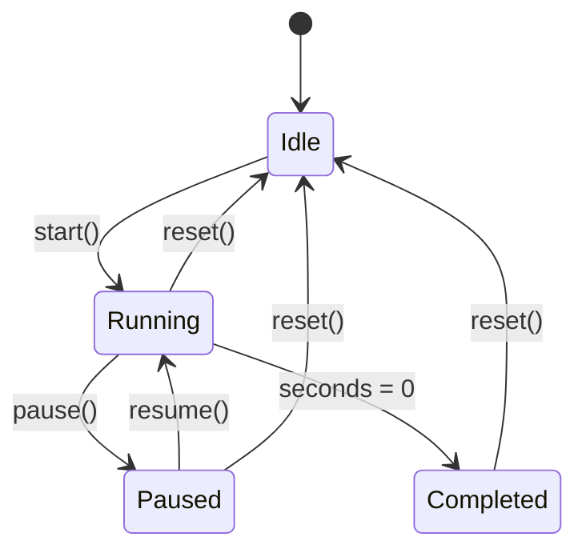

# Technical Design Document: timer-core

## Overview

**Purpose**: 「瞬発思考」アプリのコア機能として、20秒カウントダウンタイマーを提供する。ユーザーが思考を書き出す時間を視覚的に管理し、時間切れ時に次のフェーズへの遷移をトリガーする。

**Users**: アプリユーザーがタイマーを操作し、親コンポーネント（セッション管理）がタイマー終了イベントを購読する。

**Impact**: 新規コンポーネントとして、既存のproject-setup基盤上に構築される。

### Goals

- 視認性の高い残り時間表示（大きなフォント、警告色）
- 直感的な開始/停止/リセット操作
- タイマー終了時のコールバックによる親コンポーネント連携
- カスタムフックによる再利用可能なタイマーロジック

### Non-Goals

- タイマー音声・サウンド通知（後続specで対応）
- 複数タイマーの同時管理
- タイマー履歴の永続化

## Architecture

### High-Level Architecture



### Technology Alignment

| 項目 | 技術 | 既存基盤との整合性 |
|------|------|-------------------|
| UIコンポーネント | React 18.x | project-setupで構築済み |
| 状態管理 | useState + useRef | Reactビルトイン |
| タイマー制御 | setInterval/clearInterval | Web API標準 |
| スタイリング | CSS（インラインまたはCSS Modules） | 後続theme-designで統一予定 |

### Key Design Decisions

#### Decision 1: カスタムフック（useTimer）でロジックを分離

- **Context**: タイマーのビジネスロジックとUI表示の責務分離
- **Alternatives**:
  - コンポーネント内に直接実装
  - 外部状態管理ライブラリ（Redux等）
- **Selected Approach**: カスタムフック`useTimer`でタイマーロジックをカプセル化
- **Rationale**:
  - ロジックの再利用性向上
  - テスタビリティの向上
  - コンポーネントの責務を表示に集中
- **Trade-offs**: ファイル数は増えるが、保守性と再利用性が向上

#### Decision 2: useRefでintervalIdを管理

- **Context**: setIntervalのIDをコンポーネントライフサイクルで適切に管理
- **Alternatives**: useStateでintervalIdを保持
- **Selected Approach**: useRefでintervalIdを保持し、useEffectのクリーンアップで解放
- **Rationale**:
  - useRefは再レンダリングを引き起こさない
  - クリーンアップ時に確実にclearIntervalを呼び出せる
- **Trade-offs**: なし（Reactのベストプラクティス）

## State Machine



### Timer States

| 状態 | 説明 | 許可される操作 |
|------|------|---------------|
| `idle` | 初期状態（未開始） | start |
| `running` | カウントダウン中 | pause, reset |
| `paused` | 一時停止中 | resume, reset |
| `completed` | 0秒到達 | reset |

## Components and Interfaces

### Hooks Layer

#### useTimer

**Responsibility & Boundaries**
- **Primary Responsibility**: タイマーのビジネスロジック（カウントダウン、状態遷移、コールバック）を管理
- **Domain Boundary**: タイマードメイン
- **Data Ownership**: 残り秒数、タイマー状態、intervalId

**Contract Definition**

```typescript
interface UseTimerOptions {
  initialSeconds?: number;  // デフォルト: 20
  onComplete?: () => void;  // タイマー終了時コールバック
}

interface UseTimerReturn {
  seconds: number;           // 現在の残り秒数
  status: TimerStatus;       // 'idle' | 'running' | 'paused' | 'completed'
  isRunning: boolean;        // status === 'running'
  isWarning: boolean;        // seconds <= 5 && status === 'running'
  start: () => void;         // タイマー開始
  pause: () => void;         // 一時停止
  resume: () => void;        // 再開
  reset: () => void;         // リセット
}

type TimerStatus = 'idle' | 'running' | 'paused' | 'completed';

function useTimer(options?: UseTimerOptions): UseTimerReturn;
```

**State Management**
- `seconds`: useState<number> - 残り秒数
- `status`: useState<TimerStatus> - タイマー状態
- `intervalRef`: useRef<number | null> - setIntervalのID

### Components Layer

#### Timer

**Responsibility & Boundaries**
- **Primary Responsibility**: タイマーUIの表示と操作
- **Domain Boundary**: プレゼンテーション層

**Contract Definition**

```typescript
interface TimerProps {
  initialSeconds?: number;   // デフォルト: 20
  onComplete?: () => void;   // タイマー終了時コールバック
  className?: string;        // カスタムスタイル用
}

function Timer(props: TimerProps): JSX.Element;
```

**Internal Structure**

```typescript
// Timer.tsx の内部構造
function Timer({ initialSeconds = 20, onComplete, className }: TimerProps) {
  const { seconds, status, isWarning, start, pause, resume, reset } = useTimer({
    initialSeconds,
    onComplete,
  });

  return (
    <div className={className}>
      {/* 残り時間表示 */}
      {/* 操作ボタン */}
    </div>
  );
}
```

## Data Models

### Type Definitions

```typescript
// src/types/timer.ts

export type TimerStatus = 'idle' | 'running' | 'paused' | 'completed';

export interface TimerState {
  seconds: number;
  status: TimerStatus;
}

export interface UseTimerOptions {
  initialSeconds?: number;
  onComplete?: () => void;
}

export interface UseTimerReturn {
  seconds: number;
  status: TimerStatus;
  isRunning: boolean;
  isWarning: boolean;
  start: () => void;
  pause: () => void;
  resume: () => void;
  reset: () => void;
}
```

## Requirements Traceability

| 要件 | 概要 | 実現コンポーネント |
|------|------|-------------------|
| 1.1-1.4 | カウントダウン表示 | Timer（表示）、useTimer（ロジック） |
| 2.1-2.4 | タイマー開始機能 | useTimer.start() |
| 3.1-3.4 | タイマー停止機能 | useTimer.pause(), useTimer.resume() |
| 4.1-4.4 | タイマーリセット機能 | useTimer.reset() |
| 5.1-5.4 | タイマー終了コールバック | useTimer（onComplete呼び出し） |
| 6.1-6.3 | タイマー設定カスタマイズ | TimerProps.initialSeconds |

## Error Handling

### Error Categories

| エラー種別 | 原因 | 対処 |
|-----------|------|------|
| 不正な初期値 | initialSeconds <= 0 | デフォルト値（20）にフォールバック |
| 重複start呼び出し | 既にrunning状態 | 操作を無視 |
| コールバック未設定 | onCompleteがundefined | エラーなく処理完了 |

### Defensive Implementation

```typescript
// 不正な初期値の防御
const safeInitialSeconds = initialSeconds && initialSeconds > 0
  ? initialSeconds
  : 20;

// コールバックの安全な呼び出し
if (seconds === 0) {
  setStatus('completed');
  onComplete?.();  // オプショナルチェイニング
}
```

## Testing Strategy

### Unit Tests（useTimer Hook）

1. 初期状態のテスト（idle、指定秒数）
2. start()でrunning状態に遷移
3. pause()でpaused状態に遷移、秒数保持
4. resume()でrunning状態に復帰
5. reset()でidle状態、初期秒数に復帰
6. 0秒到達でcompleted状態、onComplete呼び出し
7. isWarning が5秒以下でtrueになる

### Integration Tests（Timer Component）

1. 開始ボタンクリックでカウントダウン開始
2. 停止ボタンクリックで一時停止
3. リセットボタンクリックで初期状態復帰
4. 0秒到達で親コンポーネントへコールバック
5. initialSeconds プロパティで初期値変更

### Visual Tests

1. 残り時間の大きなフォント表示
2. 5秒以下での警告色表示
3. ボタン状態の適切な切り替え

## File Structure

```
src/
├── components/
│   └── Timer/
│       ├── Timer.tsx        # メインコンポーネント
│       ├── Timer.css        # スタイル（暫定）
│       └── index.ts         # エクスポート
├── hooks/
│   └── useTimer.ts          # タイマーロジック
└── types/
    └── timer.ts             # 型定義
```
